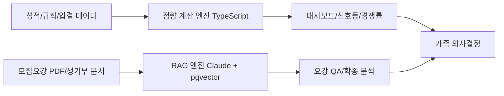

# PRD: univ - 가족 전용 AI 대입 컨설팅 웹 서비스

## 1) 프로젝트 개요

### 1.1 기본 정보
- **프로젝트명**: `univ`
- **GitHub**: [github.com/univ4/app](https://github.com/univ4/app)
- **목적**: 고3 수험생 아들을 둔 개발자 아빠가 만드는 가족 전용 AI 대입 컨설팅 웹 서비스
- **입시 목표**: 서성한(서강대/성균관대/한양대) 이공계
- **현재 성적 상태**: 모의고사 1-2등급, 내신 2-3등급
- **개발자**: 아빠 (풀스택, Cursor Pro / Claude Pro / Perplexity Pro 보유)

### 1.2 대상 사용자
- **아빠 (Admin)**: 데이터 입력, 룰 관리, 전략 분석, 최종 의사결정
- **아들 (Viewer)**: 성적 확인, 질의응답 활용, 일정 확인
- **엄마 (Viewer)**: 일정/합격 가능성 모니터링

## 2) 기술 스택
- **Frontend**: Next.js (App Router, `src/`), Tailwind CSS, Shadcn UI
- **Backend/DB**: Supabase (PostgreSQL + pgvector)
- **AI**: Claude 3.5 Sonnet API, OpenAI `text-embedding-3-small`
- **PDF 파싱**: OpenDataLoader PDF v2.0
- **배포**: Vercel

## 3) 도메인 표기 규칙 (일관성 기준)
- 전형명은 아래 표기로 통일한다.
  - `정시` (수능 위주)
  - `학생부교과`
  - `학생부종합`
  - `논술전형`
- 사용자 역할은 아래 권한 모델로 통일한다.
  - `Admin(아빠)`: 생성/수정/삭제 + 계산 규칙 관리
  - `Viewer(아들/엄마)`: 조회 + 챗봇 질의

## 4) 투 트랙 엔진 아키텍처

### 4.1 설계 원칙
- **정량 계산 엔진(Deterministic Engine)**  
  - 대상: `정시` 환산점수, `학생부교과` 내신 산출, 합격 신호등 점수 비교, `논술전형` 실질 경쟁률 계산
  - 구현: TypeScript 순수 함수 기반 결정론적 계산
  - 제약: **LLM 계산 금지**
- **RAG 엔진(LLM + Retrieval Engine)**  
  - 대상: 모집요강 질의응답, `학생부종합` 생기부 정성 분석
  - 구현: Claude 3.5 Sonnet + pgvector + 메타데이터 필터
  - 제약: 근거 없는 응답 금지, 출처 표기 필수

### 4.2 Mermaid 도식 (필요 구간만)

## 5) 범위 정의

### 5.1 In Scope
- 성적 데이터 입력/조회
- 정시 환산점수 계산
- 학생부교과 내신 산출
- 합격 가능성 신호등
- 가족 공용 입시 캘린더
- 요강 기반 RAG 챗봇
- Z점수 기반 고교 수준 해석
- 논술전형 실질 경쟁률 판독
- 세특 Gap Analysis 및 학종 정성 분석

### 5.2 Out of Scope (명확화)
- 타인/타 가족 계정 공유, 상업적 SaaS 전환
- 생기부 자동 작성/대필 기능
- 실시간 성적 자동 연동 (학교/평가원 API 직접 연계)
- 합격 보장/자동 합격 판정 기능

## 6) 기능 요구사항 (P0/P1/P2)

---

### P0-1. 성적 관리 대시보드
**설명**
- 내신: 과목별 원점수/평균/표준편차/단위수/등급 입력
- 모의고사: 영역별 표준점수/백분위/등급 입력
- 시계열 추이 시각화

**User Story**
- 나는 아빠(Admin)로서 성적 추이를 빠르게 파악하기 위해 성적 입력과 대시보드를 사용한다.
- 나는 아들(Viewer)로서 내 위치를 이해하기 위해 영역별 추이 차트를 확인한다.

**Acceptance Criteria**
- 내신/모의고사 입력값 검증(숫자 범위, 학기/회차 필수) 후 저장된다.
- 최근 12회 기준 추이 차트가 모바일/데스크톱 모두에서 정상 렌더링된다.
- Viewer 계정은 조회만 가능하고 수정 버튼이 노출되지 않는다.

---

### P0-2. 정밀 환산점수 계산 엔진 (정시)
**설명**
- 대학별 수능 반영비율, 영어 등급 환산, 과탐II 가산점, 탐구 변환표준점수 적용
- TypeScript 결정론적 계산 모듈

**User Story**
- 나는 아빠(Admin)로서 정시 대학별 유불리를 비교하기 위해 환산점수 계산 기능을 사용한다.

**Acceptance Criteria**
- 동일 입력에 대해 동일 출력이 보장된다.
- 대학별 규칙 테이블(영어/탐구/가산점/반영비율)이 계산에 반영된다.
- 계산 경로에서 LLM API 호출이 0회임이 로그로 검증된다.

---

### P0-3. 학생부교과 내신 산출 엔진
**설명**
- 대학별 반영 교과, 진로선택과목 환산 기준 반영
- 지원 대학별 실질 내신 등급 자동 계산

**User Story**
- 나는 아빠(Admin)로서 학생부교과 전형 경쟁력을 확인하기 위해 대학별 내신 산출 기능을 사용한다.

**Acceptance Criteria**
- 대학 선택 시 반영 교과/환산 규칙이 자동 로드된다.
- 진로선택과목 환산 규칙이 대학별로 적용된다.
- 산출 결과는 전형명(`학생부교과`)과 함께 저장/표시된다.

---

### P0-4. 합격 가능성 신호등
**설명**
- 어디가(adiga.kr) 입결 데이터와 성적 비교
- `안정/적정/도전` 상태 표시
- 2026학년도 의대 증원 연쇄 이동에 따른 커트라인 하락 보정 계수 적용

**User Story**
- 나는 엄마(Viewer)로서 지원 위험도를 직관적으로 확인하기 위해 합격 신호등을 사용한다.
- 나는 아빠(Admin)로서 지원 우선순위를 정하기 위해 상태 분류와 근거를 확인한다.

**Acceptance Criteria**
- 대학/학과/전형별로 `안정/적정/도전` 중 하나가 표시된다.
- 보정 계수(`med_shift_2026`)를 켜고 끌 수 있으며 결과 차이가 기록된다.
- 상태별 근거 지표(점수 차이, 기준 입결, 보정치)가 함께 노출된다.

---

### P0-5. 가족 공용 입시 캘린더
**설명**
- 원서 접수, 자소서 마감, 논술/면접 고사일 관리
- 가족 3인 공유 일정 및 알림

**User Story**
- 나는 엄마(Viewer)로서 중요한 일정을 놓치지 않기 위해 가족 공용 캘린더를 사용한다.

**Acceptance Criteria**
- 일정 생성/수정/삭제는 Admin만 가능하고 Viewer는 조회만 가능하다.
- 알림 시점(D-7/D-3/D-1/당일)을 이벤트별 설정할 수 있다.
- 모바일 월/주 보기에서 일정 탭 시 상세 정보가 1초 내 표시된다.

---

### P1-6. AI 요강 챗봇 (RAG)
**설명**
- 목표 대학 모집요강 PDF 기반 질의응답
- Claude 3.5 Sonnet + pgvector + 메타데이터 필터

**User Story**
- 나는 아들(Viewer)로서 모집요강 핵심 조건을 빠르게 확인하기 위해 요강 챗봇에 질문한다.

**Acceptance Criteria**
- 답변마다 출처(대학/연도/전형/문단)가 표기된다.
- 메타데이터 필터 미일치 문서는 검색 후보에서 제외된다.
- 근거 문단이 없으면 "확인 불가"로 응답한다.

---

### P1-7. Z점수 기반 고교 수준 판별
**설명**
- 입력 데이터: 과목별 `원점수/평균/표준편차/수강자수`
- 과목/학기 단위 Z점수 산출 및 학교 학력 밀집도 추정
- 학생부종합 해석용 참고지표 제공

**User Story**
- 나는 아빠(Admin)로서 교내 성적의 상대적 의미를 해석하기 위해 Z점수 기반 학교 수준 지표를 사용한다.

**Acceptance Criteria**
- `원점수/평균/표준편차/수강자수` 미입력 시 계산이 차단된다.
- 과목별 Z점수 계산식과 결과가 함께 표시된다.
- 결과는 `학생부종합 참고지표`로만 표시되고 자동 판정에는 사용되지 않는다.

---

### P1-8. 논술전형 실질 경쟁률 판독기
**설명**
- 수능최저 충족률과 결시율을 반영한 실질 경쟁률 계산
- 명시 로직: `실질 경쟁률 = 명목 경쟁률 x 수능최저 충족률 x (1 - 결시율)`

**User Story**
- 나는 아빠(Admin)로서 논술전형 지원 우선순위를 정하기 위해 실질 경쟁률 판독기를 사용한다.

**Acceptance Criteria**
- 수능최저 충족 여부와 충족률을 대학/전형별로 계산한다.
- 결시율을 함께 반영해 실질 경쟁률을 산출한다.
- 비교 화면에서 실질 경쟁률, 명목 경쟁률, 차이율이 동시에 표시된다.

---

### P2-9. 세특 Gap Analysis 및 액션 플랜 생성기
**설명**
- 현재 세특과 목표 대학 학생부종합 평가요소 비교
- 3학년 1학기 남은 기간 기준 탐구/수행평가 주제 제안

**User Story**
- 나는 아들(Viewer)로서 학생부종합 준비를 구체화하기 위해 세특 Gap 분석과 액션 플랜을 사용한다.

**Acceptance Criteria**
- 대학별 평가요소 대비 강점/보완점이 구조화되어 제시된다.
- 남은 기간 기준 주차별 액션 아이템이 생성된다.
- 자동 문장 대필은 제공하지 않고 주제/근거/실행순서만 제시한다.

---

### P2-10. 생기부 학생부종합 역량 분석
**설명**
- 생기부 업로드 후 `학업역량/진로역량/공동체역량` 관점 정성 분석
- 대학별 학생부종합 평가요소에 맞춘 해석 제공

**User Story**
- 나는 아빠(Admin)로서 학생부종합 관점의 강점과 보완점을 파악하기 위해 생기부 역량 분석을 사용한다.

**Acceptance Criteria**
- 문서 근거 문장과 함께 역량별 분석 결과가 제공된다.
- 대학별 평가요소 차이에 따른 해석 변화가 표시된다.
- 출처 없는 판단 문장은 결과에서 제외된다.

## 7) 비기능 요구사항 (수치 명시)

### 7.1 보안
- Supabase RLS로 가족 3인 계정만 접근 허용
- JWT 세션 만료 7일, 비활성 30일 계정 자동 잠금
- 모든 테이블에 `family_id` 스코프 강제

### 7.2 성능
- 대시보드 초기 로딩: p95 기준 3초 이내
- 챗봇 응답: p95 기준 10초 이내
- 환산점수 계산: 단일 요청 500ms 이내

### 7.3 반응형/접근성
- 모바일 기준 최소 폭 360px 지원
- 주요 화면(대시보드/신호등/캘린더) 터치 3회 이내 접근
- 텍스트 대비 WCAG AA(4.5:1) 준수

### 7.4 비용
- 월 총비용 상한: **$10**
- Free Tier 기본 사용 + API 사용량 상한으로 통제

## 8) 비용 계획 (Feasibility)

### 8.1 월 비용 추정 (MVP 사용량 가정)
- Vercel Free: $0
- Supabase Free: $0
- OpenAI Embedding (`text-embedding-3-small`): 약 $1-2
- Claude 3.5 Sonnet (요강 QA 제한 호출): 약 $5-7
- **합계 예상**: $6-9 (상한 $10 이내)

### 8.2 비용 통제 장치
- 일일 토큰/호출량 하드캡(챗봇 1일 N회)
- 긴 문서 사전 청킹/중복 임베딩 방지
- 캐시 우선(동일 질문/동일 문서 범위)

## 9) 4주 MVP 로드맵 (P0 실현 가능 범위)

### Week 1
- 인증/권한(RLS), 사용자/역할 스키마
- 성적 입력 폼 + 기본 대시보드

### Week 2
- 정시 환산점수 계산 엔진
- 학생부교과 내신 산출 엔진

### Week 3
- 합격 가능성 신호등(입결 비교 + 2026 보정 계수)
- 가족 공용 캘린더 + 알림

### Week 4
- 통합 QA, 성능 튜닝, 모바일 UI 안정화
- 운영 규칙(데이터 입력 SOP, 백업/복구 체크)

### MVP 제외 (4주 이후)
- P1/P2 전체 기능은 MVP 배포 후 순차 개발

## 10) 리스크 및 대응
- **입결 데이터 품질 리스크**  
  - 대응: 수집-정제-검증 파이프라인, 수동 검수 체크리스트
- **대학별 반영 규칙 변경 리스크**  
  - 대응: 연도별 룰 버전 테이블, 변경 이력 추적
- **AI 환각 리스크**  
  - 대응: 메타데이터 필터, 출처 강제 표기, 근거 부재 시 답변 거절
- **비용 초과 리스크**  
  - 대응: 일일 한도, 캐시 우선, 월 중간 점검 대시보드

