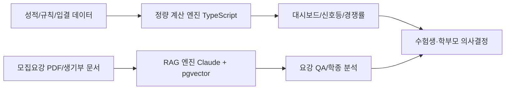

# PRD: univ4 — 수험생·학부모 AI 대입 전략 플랫폼 (v2.0.0)

**개발 로드맵 정본**: [`docs/05_ROADMAP.md`](./05_ROADMAP.md)

## 1) 프로젝트 개요

### 1.1 기본 정보
- **프로젝트명**: `univ4` <!-- v2 -->
- **GitHub**: [github.com/univ4/app](https://github.com/univ4/app)
- **목적**: 수험생과 학부모를 위한 AI 기반 대입 전략 플랫폼 <!-- v2 -->
- **버전**: v2.0.0 <!-- v2 -->
- **작성일(개정)**: 2026-03-30 <!-- v2 -->
- **입시 목표(초기 타깃 사례)**: 서성한(서강대/성균관대/한양대) 이공계
- **현재 성적 상태(초기 타깃 사례)**: 모의고사 1-2등급, 내신 2-3등급
- **개발자**: 풀스택 (Cursor Pro / Claude Pro / Perplexity Pro 보유)

### 1.2 대상 사용자
- **수험생 (Viewer)**: 성적 확인, 챗봇 질의, 지원 전략 탐색 <!-- v2 -->
- **학부모 (Viewer)**: 일정 모니터링, 합격 가능성 확인 <!-- v2 -->
- **Admin**: 데이터 입력, 룰 관리, 전략 분석 <!-- v2 -->

## 2) 기술 스택
- **Frontend**: Next.js (App Router, `src/`), Tailwind CSS, Shadcn UI
- **Backend/DB**: Supabase (PostgreSQL + pgvector)
- **AI**: Claude 3.5 Sonnet API, OpenAI `text-embedding-3-small`
- **PDF 파싱**: OpenDataLoader PDF v2.0
- **배포**: Vercel

## 3) 도메인 표기 규칙 (일관성 기준)
- 전형명은 아래 표기로 통일한다.
  - `정시` (수능 위주)
  - `학생부교과`
  - `학생부종합`
  - `논술전형`
- 사용자 역할은 아래 권한 모델로 통일한다.
  - `Admin`: 생성/수정/삭제 + 계산 규칙 관리 <!-- v2 -->
  - `Viewer(수험생/학부모)`: 조회 + 챗봇 질의 <!-- v2 -->

## 4) 투 트랙 엔진 아키텍처

### 4.1 설계 원칙
- **정량 계산 엔진(Deterministic Engine)**  
  - 대상: `정시` 환산점수, `학생부교과` 내신 산출, 합격 신호등 점수 비교, `논술전형` 실질 경쟁률 계산
  - 구현: TypeScript 순수 함수 기반 결정론적 계산
  - 제약: **LLM 계산 금지**
- **RAG 엔진(LLM + Retrieval Engine)**  
  - 대상: 모집요강 질의응답, `학생부종합` 생기부 정성 분석
  - 구현: Claude 3.5 Sonnet + pgvector + 메타데이터 필터
  - 제약: 근거 없는 응답 금지, 출처 표기 필수

### 4.2 Mermaid 도식 (필요 구간만)

<!-- v2: Mermaid 노드 G — 가족 의사결정 → 수험생·학부모 의사결정 -->

## 5) 범위 정의

### 5.1 In Scope
- 성적 데이터 입력/조회
- 정시 환산점수 계산
- 학생부교과 내신 산출
- 합격 가능성 신호등
- 가족 공용 입시 캘린더
- 요강 기반 RAG 챗봇
- Z점수 기반 고교 수준 해석
- 논술전형 실질 경쟁률 판독
- 세특 Gap Analysis 및 학종 정성 분석
- **선택과목 조합 기반 지원 전략 분석기**(프로필 저장, 2027학년도 기준 지원 가능·유불리·조합 추천; 상세는 P1-11)
- **전국 단위 입결·전형 조건 기반 탐색·필터**(P1-15, P1-16; data-collector 연동) <!-- v2 -->

### 5.2 Out of Scope (명확화) <!-- v2: "타인/타 가족 계정 공유, 상업적 SaaS 전환" 항목 제거 -->
- 생기부 자동 작성/대필 기능
- 실시간 성적 자동 연동 (학교/평가원 API 직접 연계)
- 합격 보장/자동 합격 판정 기능

### 5.3 신규 DB 테이블 (스키마 보강)
- **`academic_records`**: 과목별 내신 원점수·평균·표준편차·단위수·석차등급 등(P2-11 NEIS PDF 파싱 적재 대상)
- **`subject_profiles`**: 학생별 수능 선택과목 조합 프로필(P1-11 연계)
- **`univ_subject_requirements`**: 대학·학과(모집단위)별 선택과목 지원 조건(P1-11 연계)
- (FK용) **`universities`**, **`departments`**: `univ_subject_requirements` 참조 테이블

## 6) 기능 요구사항 (P0/P1/P2/P3)

기능 수 요약:
- **P0: 5개**
- **P1: 17개** <!-- v2: +P1-15, P1-16, P1-17 -->
- **P2: 12개** <!-- v2: +P2-9~P2-12 -->
- **P3: 6개** <!-- v2: 구 P3-2 정시 배치표 → P2-12 통합, +P3-6 -->

---

### P0-1. 성적 관리 대시보드
**설명**
- 내신: 과목별 원점수/평균/표준편차/단위수/등급 입력
- 모의고사: 영역별 표준점수/백분위/등급 입력
- 시계열 추이 시각화

**User Story**
- 나는 아빠(Admin)로서 성적 추이를 빠르게 파악하기 위해 성적 입력과 대시보드를 사용한다.
- 나는 아들(Viewer)로서 내 위치를 이해하기 위해 영역별 추이 차트를 확인한다.

**Acceptance Criteria**
- 내신/모의고사 입력값 검증(숫자 범위, 학기/회차 필수) 후 저장된다.
- 최근 12회 기준 추이 차트가 모바일/데스크톱 모두에서 정상 렌더링된다.
- Viewer 계정은 조회만 가능하고 수정 버튼이 노출되지 않는다.

---

### P0-2. 정밀 환산점수 계산 엔진 (정시)
**설명**
- 대학별 수능 반영비율, 영어 등급 환산, 과탐II 가산점, 탐구 변환표준점수 적용
- TypeScript 결정론적 계산 모듈
- **18개 대학**에 대해 수능 반영비율·영어 등급 환산표·과탐 가산점 등은 **data-collector**에서 생성한 구조화 JSON(`admission_db.json` 등)으로 **자동 로드**한다. <!-- v2 -->

**User Story**
- 나는 아빠(Admin)로서 정시 대학별 유불리를 비교하기 위해 환산점수 계산 기능을 사용한다.

**Acceptance Criteria**
- 동일 입력에 대해 동일 출력이 보장된다.
- 대학별 규칙 테이블(영어/탐구/가산점/반영비율)이 계산에 반영된다.
- 계산 경로에서 LLM API 호출이 0회임이 로그로 검증된다.
- data-collector **`admission_db.json`** 기반 규칙이 빌드/런타임에 자동 로드되며, 해당 범위에서 **수동 규칙 입력 없이** 계산이 가능하다. <!-- v2 -->

---

### P0-3. 학생부교과 내신 산출 엔진
**설명**
- 대학별 반영 교과, 진로선택과목 환산 기준 반영
- 지원 대학별 실질 내신 등급 자동 계산

**User Story**
- 나는 아빠(Admin)로서 학생부교과 전형 경쟁력을 확인하기 위해 대학별 내신 산출 기능을 사용한다.

**Acceptance Criteria**
- 대학 선택 시 반영 교과/환산 규칙이 자동 로드된다.
- 진로선택과목 환산 규칙이 대학별로 적용된다.
- 산출 결과는 전형명(`학생부교과`)과 함께 저장/표시된다.

---

### P0-4. 합격 가능성 신호등
**설명**
- 어디가(adiga.kr) 입결 데이터와 성적 비교
- `안정/적정/도전` 상태 표시
- 2026학년도 의대 증원 연쇄 이동에 따른 커트라인 하락 보정 계수 적용
- **목표 대학 수동 지정** 외에, 성적 입력 시 **199개 대학 전체**에 대해 자동 신호등을 생성하는 **옵션**을 제공한다. <!-- v2 -->

**User Story**
- 나는 엄마(Viewer)로서 지원 위험도를 직관적으로 확인하기 위해 합격 신호등을 사용한다.
- 나는 아빠(Admin)로서 지원 우선순위를 정하기 위해 상태 분류와 근거를 확인한다.

**Acceptance Criteria**
- 대학/학과/전형별로 `안정/적정/도전` 중 하나가 표시된다.
- 보정 계수(`med_shift_2026`)를 켜고 끌 수 있으며 결과 차이가 기록된다.
- 상태별 근거 지표(점수 차이, 기준 입결, 보정치)가 함께 노출된다.
- **「전체 대학 스캔」** 실행 시 199개 대학에 대한 안정/적정/도전 분류 결과가 **3초 이내**에 표시된다. <!-- v2 -->

---

### P0-5. 가족 공용 입시 캘린더
**설명**
- 원서 접수, 자소서 마감, 논술/면접 고사일 관리
- 가족 3인 공유 일정 및 알림

**User Story**
- 나는 엄마(Viewer)로서 중요한 일정을 놓치지 않기 위해 가족 공용 캘린더를 사용한다.

**Acceptance Criteria**
- 일정 생성/수정/삭제는 Admin만 가능하고 Viewer는 조회만 가능하다.
- 알림 시점(D-7/D-3/D-1/당일)을 이벤트별 설정할 수 있다.
- 모바일 월/주 보기에서 일정 탭 시 상세 정보가 1초 내 표시된다.

---

### P1-1. AI 요강 챗봇 (RAG)
**설명**
- 목표 대학 모집요강 PDF 기반 질의응답
- Claude 3.5 Sonnet + pgvector + 메타데이터 필터

**User Story**
- 나는 아들(Viewer)로서 모집요강 핵심 조건을 빠르게 확인하기 위해 요강 챗봇에 질문한다.

**Acceptance Criteria**
- 답변마다 출처(대학/연도/전형/문단)가 표기된다.
- 메타데이터 필터 미일치 문서는 검색 후보에서 제외된다.
- 근거 문단이 없으면 "확인 불가"로 응답한다.

---

### P1-2. Z점수 기반 고교 수준 판별
**설명**
- 입력 데이터: 과목별 `원점수/평균/표준편차/수강자수`
- 과목/학기 단위 Z점수 산출 및 학교 학력 밀집도 추정
- 학생부종합 해석용 참고지표 제공

**User Story**
- 나는 아빠(Admin)로서 교내 성적의 상대적 의미를 해석하기 위해 Z점수 기반 학교 수준 지표를 사용한다.

**Acceptance Criteria**
- `원점수/평균/표준편차/수강자수` 미입력 시 계산이 차단된다.
- 과목별 Z점수 계산식과 결과가 함께 표시된다.
- 결과는 `학생부종합 참고지표`로만 표시되고 자동 판정에는 사용되지 않는다.

---

### P1-3. 논술전형 실질 경쟁률 판독기
**설명**
- 수능최저 충족률과 결시율을 반영한 실질 경쟁률 계산
- 명시 로직: `실질 경쟁률 = 명목 경쟁률 x 수능최저 충족률 x (1 - 결시율)`

**User Story**
- 나는 아빠(Admin)로서 논술전형 지원 우선순위를 정하기 위해 실질 경쟁률 판독기를 사용한다.

**Acceptance Criteria**
- 수능최저 충족 여부와 충족률을 대학/전형별로 계산한다.
- 결시율을 함께 반영해 실질 경쟁률을 산출한다.
- 비교 화면에서 실질 경쟁률, 명목 경쟁률, 차이율이 동시에 표시된다.

---

### P1-4. 세특 Gap Analysis 및 액션 플랜 생성기
**설명**
- 현재 세특과 목표 대학 학생부종합 평가요소 비교
- 3학년 1학기 남은 기간 기준 탐구/수행평가 주제 제안

**User Story**
- 나는 아들(Viewer)로서 학생부종합 준비를 구체화하기 위해 세특 Gap 분석과 액션 플랜을 사용한다.

**Acceptance Criteria**
- 대학별 평가요소 대비 강점/보완점이 구조화되어 제시된다.
- 남은 기간 기준 주차별 액션 아이템이 생성된다.
- 자동 문장 대필은 제공하지 않고 주제/근거/실행순서만 제시한다.

---

### P1-5. 생기부 학생부종합 역량 분석
**설명**
- 생기부 업로드 후 `학업역량/진로역량/공동체역량` 관점 정성 분석
- 대학별 학생부종합 평가요소에 맞춘 해석 제공

**User Story**
- 나는 아빠(Admin)로서 학생부종합 관점의 강점과 보완점을 파악하기 위해 생기부 역량 분석을 사용한다.

**Acceptance Criteria**
- 문서 근거 문장과 함께 역량별 분석 결과가 제공된다.
- 대학별 평가요소 차이에 따른 해석 변화가 표시된다.
- 출처 없는 판단 문장은 결과에서 제외된다.

---

### P1-6. 자소서 코치 (Self-Introduction Letter Coach)
**설명**
- 대학별 자소서 문항 DB 저장
- 아들이 초안 입력 시 Claude 3.5 Sonnet이 목표 대학 평가요소 기준으로 피드백
- 글자 수 카운터 및 초과 경고

**User Story**
- 나는 아들로서 자소서 초안을 입력하고 목표 대학 기준의 구체적 피드백을 받기 위해 자소서 코치를 사용한다.

**Acceptance Criteria**
- 초안 입력 후 30초 이내 피드백 반환
- 피드백에 평가요소(`학업역량/진로역량/공동체역량`) 기준 항목별 코멘트 포함
- 글자 수 실시간 카운터 표시

---

### P1-7. 6장 원서 배분 전략 시뮬레이터
**설명**
- 수시 6장을 어떻게 배분할지 시뮬레이션
- 목표 대학/전형 선택 시 `안정/적정/도전` 비율 자동 계산
- `도전 4장 / 적정 1장 / 안정 1장` 등 리스크 조합 경고
- **전형 유형별 조합 추천 로직**
  - 교과 성적 우세 시: 교과 4~5개 + 학종 1~2개 조합 추천
  - 학종 성적 우세 시: 학종 4~5개 + 교과 1~2개 조합 추천
- **수시 전원 불합격 시 정시 안전망** 자동 계산(Track 1 기반 환산·입결 비교; LLM 금지)

**User Story**
- 나는 아빠로서 아들의 수시 6장 배분을 최적화하기 위해 원서 배분 시뮬레이터를 사용한다.

**Acceptance Criteria**
- 6개 초과 선택 시 경고 표시
- 안정 0장 선택 시 리스크 경고 표시
- 선택 변경 시 실시간 포트폴리오 재계산
- 교과·학종 우세 유형에 따라 권장 6장 조합(교과/학종 비율)이 제시된다
- 수시 전원 불합격 시 정시 안전망(환산점수·입결 대비)이 자동 산출되어 표시된다

---

### P1-8. 탐구 주제 추천 엔진
**설명**
- 현재 세특 분석 결과에서 부족한 역량 파악
- 목표 대학/학과 인재상과 매칭하여 탐구 주제 자동 생성
- 탐구 주제별 난이도/소요 시간/연계 교과목 제안

**User Story**
- 나는 아들로서 3학년 1학기 세특에 작성할 탐구 주제를 추천받기 위해 탐구 주제 추천 엔진을 사용한다.

**Acceptance Criteria**
- 목표 대학/학과 선택 후 탐구 주제 5개 이상 생성
- 각 주제에 연계 교과목과 난이도(상/중/하) 포함
- 현재 세특과 중복되지 않는 주제만 추천

---

### P1-9. AI 모의 면접 코치
**설명**
- 목표 대학/전형 선택 시 실제 기출 면접 질문 기반 질문 생성
- 생기부 세특 내용을 RAG로 참조하여 서류기반 예상 질문 자동 생성
- 텍스트 답변 입력 시 Claude가 평가 및 개선 제안

**User Story**
- 나는 아들로서 학종 면접을 대비하기 위해 AI 모의 면접을 사용한다.

**Acceptance Criteria**
- 생기부 세특 기반 예상 질문 5개 이상 생성
- 답변 입력 후 강점/보완점 피드백 반환
- 대학별 면접 유형(`서류기반/MMI/교직인적성`) 구분 지원

---

### P1-10. 수능 가채점 환산 계산기
**설명**
- 수능 당일 가채점 점수 입력 시 예상 표준점수/백분위 즉시 계산
- 대학별 환산점수 즉시 산출 및 정시 지원 가능 대학 목록 생성

**User Story**
- 나는 아빠로서 수능 당일 가채점 직후 아들의 정시 지원 가능 대학을 파악하기 위해 가채점 계산기를 사용한다.

**Acceptance Criteria**
- 가채점 입력 후 30초 이내 환산점수 산출
- 전체 목표 대학군에 대한 합격 가능성 신호등 즉시 표시
- 전년도 등급컷과 비교하여 예상 등급 범위 제공

---

### P1-11. 선택과목 조합 기반 지원 전략 분석기

**개요**
- 학생이 고교에서 선택한 **수능 과목 조합**을 프로필로 저장하고, **2027학년도** 기준으로 지원 가능한 대학·학과와 유불리를 분석하는 기능.

**핵심 로직 3가지**
1. **지원 가능 필터링**: 대학별 지정 과목 조건 충족 여부 (예: 미적/기하 미응시 시 자연계 지원 불가)
2. **유불리 분석**: 선택과목별 표준점수 유불리 (응시 집단 규모·평균 차이)
3. **조합 추천**: 목표 대학군 기준 역산하여 유리한 과목 조합 제안

**데이터 모델 (신규 테이블 2개)**
- `subject_profiles`: 학생의 선택과목 조합 저장  
  - `student_id`, 국어(언매/화작), 수학(미적/기하), 탐구1, 탐구2, 제2외국어
- `univ_subject_requirements`: 대학별 선택과목 지원 조건  
  - `univ_id`, `dept_id`, `required_subjects`(jsonb), `preferred_subjects`(jsonb), `year`(2027)

**트랙 분류**
- 지원 가능 필터링 → **Track 1** (순수 조건 비교 함수)
- 유불리 분석 → **Track 1** (통계 계산)
- 조합 추천 **설명** → **Track 2** (Claude 자연어 설명)

**User Story**
- 나는 아빠로서 아들의 선택과목 조합(언매·미적·지구과학·사회문화)으로 2027학년도에 지원 가능한 대학·학과와 불리한 조건을 한눈에 파악하고 싶다.

**Acceptance Criteria**
1. 선택과목 조합 저장 후 목표 대학 **30개 전체**에 대해 지원 가능 여부 즉시 표시
2. 선택과목 변경 시 지원 가능 대학 목록 **실시간 재계산**
3. “이 조합으로 불리한 대학/학과” **경고 리스트** 표시
4. Claude가 조합의 강점·약점을 **2~3줄**로 요약

---

### P1-12. 입시 D-Day 캘린더 + 역산 TO-DO 생성기
**설명**
- 2027학년도 주요 입시 일정 전체를 타임라인으로 시각화  
  (수시 원서접수(2026.09.07~), 수능(2026.11.12), 정시 원서접수, 합격발표, 등록 마감 등)
- 오늘 기준 각 이벤트까지 D-Day 자동 계산 및 표시
- 역산 TO-DO 자동 생성: “수시 원서접수까지 D-N” 기준으로 이번 주·이번 달 해야 할 일 목록 생성
- 단계별 알림: D-30, D-7, D-1 시점에 할 일 알림 표시

**트랙 분류**
- D-Day 계산 → **Track 1**
- TO-DO 문구 생성 → **Track 2**

**User Story**
- 나는 아빠로서 수시 원서접수까지 남은 기간 동안 아들이 무엇을 언제까지 해야 하는지 역산하여 주간 TO-DO로 받고 싶다.

**Acceptance Criteria**
1. 오늘 날짜 기준 전체 입시 일정 D-Day 자동 표시
2. 수시 원서접수 기준 역산하여 주간 TO-DO 5개 이상 생성
3. D-30/D-7/D-1 도달 시 대시보드 상단에 알림 배너 표시
4. 일정 변경(연도 변경 등) 시 전체 D-Day 자동 재계산

---

### P1-13. 수능최저 충족 확률 계산기
**설명**
- 현재 모의고사 성적 기준 목표 대학별 수능최저 조건 충족 확률 계산
- 과목별 성적 편차와 모의고사 회차별 트렌드를 반영한 확률 산출
- “수능최저 충족을 위해 가장 집중해야 할 과목” 자동 추천

**트랙 분류**
- 확률 계산 → **Track 1**
- 과목 추천 설명 → **Track 2**

**User Story**
- 나는 아빠로서 아들의 모의고사 성적 기준으로 목표 대학 수능최저를 충족할 확률을 알고 어느 과목에 집중해야 할지 파악하고 싶다.

**Acceptance Criteria**
1. 목표 대학 전체에 대해 수능최저 충족 확률(%) 표시
2. 충족 확률 50% 미만 대학에 경고 표시
3. “이 과목 1등급 올리면 충족 확률 +N%” 시뮬레이션 제공
4. 모의고사 회차 추가 시 확률 자동 재계산

---

### P1-14. 생기부 공백 탐지기
**설명**
- 생기부 항목별(세특·수상·봉사·독서·자율·동아리) 입력 현황 자동 점검
- 항목별 글자수 기준 미달 경고 (세특 과목당 500자 이하, 독서 5권 미만 등)
- 목표 대학 인재상 대비 진로 일관성 점수 계산
- “이 항목이 비어있으면 OO대 학종에서 감점 요인” 경고 메시지 생성

**트랙 분류**
- 글자수·기준 미달 탐지 → **Track 1**
- 인재상 매칭·감점 설명 → **Track 2**

**User Story**
- 나는 아빠로서 아들의 생기부에서 학종 평가에 불리한 공백 항목을 자동으로 찾아내고 보완 방법을 알고 싶다.

**Acceptance Criteria**
1. 생기부 데이터 기준 항목별 미달 여부 즉시 표시
2. 목표 대학별로 “치명적 공백 / 보완 권장 / 양호” 3단계 신호등 표시
3. 공백 항목에 대해 구체적 보완 방법 1-2줄 제안
4. 진로 일관성 점수 0-100점으로 표시

---

### P1-15. 전국 대학 지원 가능 탐색기 <!-- v2 -->
**우선순위**: P1 (넓이 확장 핵심 기능)

**설명**
- 내신/수능 성적 입력 시 **199개 대학** 전체에서 안정·적정·도전 대학 자동 분류
- 전형 유형별 필터 (`학생부교과` / `학생부종합` / `정시`)
- 조건 필터: 수능최저 없음, 면접 없음, 교과 100% 등 (P1-16과 조합 가능)

**데이터 소스**
- 어디가 입결 199개 대학 (`admission_db.json`)
- 전형계획 PDF 파싱 결과 18개 대학 (수능최저 조건)

**트랙 분류**
- 필터링·신호등 계산 → **Track 1**
- 탐색 결과 설명 → **Track 2**

**User Story**
- 나는 수험생으로서 내 성적을 입력하면 전국 대학 중 내가 지원 가능한 대학을 전형별로 한눈에 보고 싶다.

**Acceptance Criteria**
1. 내신 또는 수능 성적 입력 시 199개 대학 안정·적정·도전 자동 분류
2. 전형 유형 / 수능최저 유무 / 지역 필터 적용 가능
3. 결과를 대학명·전형명·컷오프·신호등 형태의 표로 표시
4. 조건 변경 시 실시간 재계산 (**3초 이내**)

---

### P1-16. 조건부 대학 필터링 <!-- v2 -->
**우선순위**: P1 (넓이 확장)

**설명**
- 수능최저 없음, 면접 없음, 교과 100%, 논술 없음 등 조건으로 대학 필터링
- **18개 대학** 전형계획 PDF에서 추출한 상세 조건 DB 활용
- 조건 조합 시 해당 조건을 충족하는 대학·전형 목록 즉시 표시

**트랙 분류**
- 조건 매칭 → **Track 1**

**User Story**
- 나는 수험생으로서 "수능최저가 없는 학생부교과전형"만 골라서 내 내신으로 지원 가능한 대학을 보고 싶다.

**Acceptance Criteria**
1. 조건 선택 시 해당 전형만 필터링하여 표시
2. 복수 조건 **AND** 조합 지원
3. 필터 결과 0건일 경우 "조건을 완화해 보세요" 안내

---

### P1-17. 합격 확률 % 표시 (70% 컷 기반) <!-- v2: 경쟁 서비스 분석 반영 -->
**우선순위**: P1

**설명**
- 기존 `안정/적정/도전` 3단계 신호등에 **합격 확률(%)** 수치를 병기한다.
- **기준**: 최종등록자 **70% 컷** 대비 내 점수 위치(Track 1 순수 함수; **LLM 금지**).
- **구간 라벨(확률 %와 함께 표시되는 티어)**  
  - **하향**: 85% 이상 (컷 대비 +5점 초과)  
  - **적정**: 70~80% (컷 ±5점 범위)  
  - **소신**: 40~50% (컷 대비 -5점 이하)  
  (세부 임계값·표시 문구는 Track 1 함수와 UI에서 동일하게 적용)

**데이터 소스**
- `admission_records`(이미 적재 완료). 추가 데이터 소스 불필요.

**트랙 분류**
- 확률·점수차 계산 → **Track 1**

**User Story**
- 나는 수험생으로서 "합격 가능성이 몇 %인지" 숫자로 확인하고 싶다.

**Acceptance Criteria**
1. 신호등 옆에 합격 확률 % 수치 표시
2. 70% 컷 기준값과 내 점수 차이를 함께 표시
3. 보정 계수(`med_shift_2026`) ON/OFF 시 % 수치도 함께 변동

**구현 참고**
- UI는 **P0-4 합격 가능성 신호등** 구현 시 병행한다(로드맵 §Week 4 이후).

---

### P2-1. 세특 Gap Analysis 및 액션 플랜 생성기
**설명**
- 현재 세특과 목표 대학 학생부종합 평가요소 비교
- 3학년 1학기 남은 기간 기준 탐구/수행평가 주제 제안

**User Story**
- 나는 아들(Viewer)로서 학생부종합 준비를 구체화하기 위해 세특 Gap 분석과 액션 플랜을 사용한다.

**Acceptance Criteria**
- 대학별 평가요소 대비 강점/보완점이 구조화되어 제시된다.
- 남은 기간 기준 주차별 액션 아이템이 생성된다.
- 자동 문장 대필은 제공하지 않고 주제/근거/실행순서만 제시한다.

---

### P2-2. 생기부 학생부종합 역량 분석
**설명**
- 생기부 업로드 후 `학업역량/진로역량/공동체역량` 관점 정성 분석
- 대학별 학생부종합 평가요소에 맞춘 해석 제공

**User Story**
- 나는 아빠(Admin)로서 학생부종합 관점의 강점과 보완점을 파악하기 위해 생기부 역량 분석을 사용한다.

**Acceptance Criteria**
- 문서 근거 문장과 함께 역량별 분석 결과가 제공된다.
- 대학별 평가요소 차이에 따른 해석 변화가 표시된다.
- 출처 없는 판단 문장은 결과에서 제외된다.

---

### P2-3. 경쟁률 실시간 모니터링
**설명**
- 수시 원서 접수 기간 중 목표 대학/전형 경쟁률 추이 그래프 제공
- 경쟁률 급등 시 알림 기능 제공

---

### P2-4. 논술 기출 분석기
**설명**
- 목표 대학 논술 기출문제 PDF를 RAG 인덱스로 적재
- 출제 경향 및 빈출 개념 자동 분석

---

### P2-5. 성적 예측 시뮬레이터
**설명**
- 남은 학기 내신 목표 등급 설정 시 최종 내신 변화 시뮬레이션
- 특정 과목 등급 향상이 합격 가능성에 미치는 영향 계산

---

### P2-6. 수시·정시 통합 전략 뷰
**설명**
- 수시 6장과 정시 포트폴리오를 한 화면에서 조율하는 통합 대시보드
- 수시 납치 리스크 계산: “이 대학 수시 합격 시 포기하게 되는 정시 기회” 손익 시각화
- 수시 합격 시나리오별 정시 영향도 시뮬레이션

**트랙 분류**
- 납치 리스크 계산 → **Track 1**
- 전략 설명 → **Track 2**

**User Story**
- 나는 아빠로서 수시와 정시 전략을 동시에 보면서 수시 납치 리스크를 고려한 최적 배분을 결정하고 싶다.

**Acceptance Criteria**
1. 수시 6장 선택 시 정시 포기 기회비용 자동 계산
2. “수시 전원 불합격 시 정시 안전망” 시나리오 자동 생성
3. 수시·정시 통합 합격 가능성 요약 표시

---

### P2-7. 합격자 스펙 비교 분석기
**설명**
- 목표 대학·전형별 최근 3개년 합격자 평균 스펙(내신·모의고사·세특 활동 수준)과 비교
- “나의 스펙 vs 합격자 평균” 레이더 차트 시각화
- 차이가 큰 항목에 대해 보완 전략 제안
- 데이터 출처: 대학 공시 데이터 + 입시 기관 공개 통계 RAG 적재

**트랙 분류**
- 스펙 차이 계산 → **Track 1**
- 보완 전략 설명 → **Track 2**

**User Story**
- 나는 아들로서 내 스펙이 목표 대학 합격자 평균과 얼마나 차이나는지 항목별로 보고 싶다.

**Acceptance Criteria**
1. 목표 대학·전형 선택 시 합격자 평균 스펙과 내 스펙 비교 표 즉시 표시
2. 레이더 차트로 항목별 차이 시각화
3. 차이가 가장 큰 항목 상위 3개에 대해 보완 방법 제안

---

### P2-8. N수생 비율 및 경쟁 강도 분석기
**설명**
- 정시 전형에서 목표 대학·학과별 N수생 비율 및 특목고 지원 비율 표시
- N수생 비율이 높은 대학·학과에 경고 표시 (“재수생 多 → 커트라인 상승 가능”)
- 일반고 출신 합격 비율이 높은 전형 추천
- 데이터 출처: 대학 입학처 공시 데이터 RAG 적재

**User Story**
- 나는 아빠로서 정시 지원 시 N수생이 많아 커트라인이 높아질 대학·학과를 사전에 파악하고 싶다.

**Acceptance Criteria**
1. 목표 대학 전체에 대해 N수생 비율 표시
2. N수생 50% 초과 시 경고 배지 표시
3. 일반고 출신 합격 비율 기준 유리한 전형 추천

---

### P2-9. 연도별 입결 추이 분석기 <!-- v2 -->
**우선순위**: P2

**설명**
- 어디가 데이터의 **2024·2025학년도** 입결 추이 비교
- 대학·전형·모집단위별 컷오프 변화 방향 시각화
- “올해 이 대학 커트라인이 오를까 내릴까” 예측 **참고 지표** 제공 (보장 아님)

**데이터 소스**
- 어디가 입결 199개 대학 (연도별 데이터)

**트랙 분류**
- 추이 계산·시각화 → **Track 1**
- 변화 원인 해석 → **Track 2**

**User Story**
- 나는 학부모로서 목표 대학의 커트라인이 최근 몇 년간 어떻게 변했는지 추이를 보고 싶다.

**Acceptance Criteria**
1. 대학·전형 선택 시 최근 2개년 컷오프 추이 차트 표시
2. 상승/하락/유지 방향을 화살표로 명시
3. 의대 증원 등 외부 요인 설명 문구 자동 표시

---

### P2-10. 정시 군별 지원 전략 분석기 <!-- v2 -->
**우선순위**: P2

**설명**
- 가군·나군·다군별 지원 조합 시뮬레이션
- 정시자료 PDF 기반 대학 간 중복 지원 패턴 데이터 활용
- “이 대학 가군 지원자가 나군에서 많이 지원하는 대학” 패턴 제시

**데이터 소스**
- 정시자료 PDF 파싱 결과 (`interim/parsed/정시자료_서울권/`, `interim/parsed/정시자료_수도권/`)

**트랙 분류**
- 군별 조합 계산 → **Track 1**
- 지원 전략 설명 → **Track 2**

**User Story**
- 나는 아빠로서 정시에서 가·나·다군을 어떻게 조합할지 다른 수험생들의 지원 패턴을 참고해서 결정하고 싶다.

**Acceptance Criteria**
1. 가·나·다군 각 1개 대학 선택 시 조합 리스크 자동 평가
2. 유사 성적대 수험생들의 군별 중복 지원 패턴 상위 5개 표시
3. “이 조합의 안전망 시나리오” 자동 생성

---

### P2-11. 나이스 PDF 자동 파싱 및 성적 적재
**우선순위**: P2

**설명**
- 나이스(NEIS) 성적표 **PDF/PNG** 업로드 → **Claude Vision** 파싱 → 내신 필드 자동 입력·`academic_records` upsert (`scripts/ingest/parse_neis_grades.ts` 패턴 재사용)
- 수능 **공식 성적표 PNG** 업로드 → Claude Vision 파싱 → **모의고사/수능 영역 성적** 자동 입력(결정론적 검증·저장 로직은 Track 1 경계에서 처리)
- 나이스(NEIS) 성적표 PDF(학기별)를 업로드하면 과목별 원점수/평균/표준편차/단위수/석차등급을 자동 파싱
- `academic_records` 테이블에 upsert 적재
- 추후 학기 추가 시 동일 흐름으로 처리

**현재 상태**
- 1학년 1·2학기, 2학년 1학기 성적표는 수동 입력 완료
- 2학년 2학기, 3학년 1학기 성적표 추가 시 자동화 활용 예정

**데이터 소스**
- 나이스(neis.go.kr) 성적표 PDF

**트랙 분류**
- PDF 파싱 후 결정론적 적재 → **Track 1**

**User Story**
- 나는 아빠(Admin)로서 학기말마다 성적표 PDF를 업로드하면 수동 입력 없이 자동으로 성적이 반영되기를 원한다.

**Acceptance Criteria**
1. PDF 업로드 시 학기 자동 감지 (1-1, 1-2, 2-1 등)
2. 파싱 결과 미리보기 후 확인 시 적재
3. 동일 학기 재업로드 시 upsert (중복 없음)
4. 파싱 실패 항목은 수동 입력 폼으로 fallback
5. 수능 성적표 이미지 업로드 시 영역별 파싱 결과 미리보기 후 확인 시 성적 필드 반영

---

### P2-12. 정시 배치표 <!-- v2: 구 P3-2에서 P2 상향·통합 -->
**우선순위**: P2

**설명**
- 수능 성적 입력 시 지원 가능 대학을 **배치표 형태**로 표시한다.
- 성적 구간별(**안정/적정/소신**)로 대학을 가로 배치한다.
- 구 **P3-2 정시 배치표 자동 생성** 요구를 본 항목에 통합한다.

**데이터 소스**
- `admission_records`(이미 적재 완료). 추가 데이터 불필요.

**트랙 분류**
- 구간 분류·표 데이터 생성 → **Track 1**
- 배치표 설명 문구 → **Track 2**(선택)

**User Story**
- 나는 수험생으로서 내 성적대에 어느 대학이 있는지 배치표로 한눈에 보고 싶다.

**Acceptance Criteria**
1. 수능 성적 입력 시 성적 구간별 대학 목록 표시
2. 안정/적정/소신 구간으로 구분
3. 대학명/학과명/전형명/컷오프 표시

---

### P3-1. (Reserved)
**설명**
- 중장기 자동화 기능 확장 슬롯

---

### P3-2. 카카오톡 알림 연동 <!-- v2: 구 P3-3 번호 정리 -->
**설명**
- 원서 접수 `D-7`, `D-1` 자동 알림
- 합격 발표일 알림

---

### P3-3. 고1/고2 선행 관리 <!-- v2: 구 P3-4 -->
**설명**
- 학년별 내신 목표 설정 및 역산 계획표 자동 생성

---

### P3-4. 과탐 가산점 시뮬레이터 <!-- v2: 구 P3-5 -->
**우선순위**: P3

**설명**
- 대학별 과탐 가산점 비율 (3%·5%·6% 등) 적용 시 환산점수 변화 시뮬레이션
- 과탐II 선택 여부에 따른 유불리 대학별 비교
- 데이터 소스: 정시자료 PDF 파싱 결과

**트랙 분류**
- 가산점 계산 → **Track 1**

**User Story**
- 나는 수험생으로서 내가 과탐II를 선택했을 때 어느 대학에서 가산점이 붙어 유리해지는지 알고 싶다.

**Acceptance Criteria**
1. 과탐II 선택 여부 토글 시 환산점수 변화 즉시 표시
2. 가산점 적용 대학 목록과 비율 표시
3. 가산점 여부에 따른 신호등 변화 표시

---

### P3-5. (Reserved) 중장기 연동·실험 슬롯
**설명**
- 서비스 오픈 이후 우선순위에 따라 채울 장기 과제(알림 채널 확장, 운영 대시보드 등). 상세는 [`docs/05_ROADMAP.md`](./05_ROADMAP.md)에서 관리한다.

---

### P3-6. 모의지원 (사용자 표본 기반 합격 예측) <!-- v2: 경쟁 서비스 분석 반영 -->
**우선순위**: P3 (서비스 오픈 후 사용자 **수천 명** 규모 이상일 때)

**설명**
- 동일 대학·학과에 **모의지원한 univ4 사용자** 중 나의 상대 위치를 표시한다.
- 진학사 등 유사 서비스와 유사하나, **계산 근거·표본 한계를 UI에 투명 공개**한다.
- 표본이 충분하지 않으면 의미 없으므로 **오픈 후 장기 과제**로 둔다.

**구현 전제 조건**
- univ4 가입 사용자 수천 명 이상
- 사용자 성적 데이터 **익명화 처리·이용 동의** 체계 구축
- 개인정보 처리방침 업데이트

**트랙 분류**
- 순위·백분위 계산 → **Track 1**(표본 집계가 가능해진 뒤)
- 해석·주의 문구 → **Track 2**

**User Story**
- 나는 수험생으로서 같은 목표 대학에 지원한 동료들 사이에서 내 성적이 어느 정도 위치인지 참고하고 싶다.

**Acceptance Criteria**
1. 표본 수가 통계적으로 의미 있을 때만(임계값은 구현 시 명시) 위치 지표 표시
2. 표본 부족 시 기능 비활성 또는 안내 문구 표시
3. 계산식·표본 크기·연도 범위를 화면에 노출

## 7) 비기능 요구사항 (수치 명시)

### 7.1 보안
- Supabase RLS로 **인증된 사용자만** 데이터에 접근한다. <!-- v2 -->
- **일반 수험생 가입**: 이메일 인증 후 개인 계정 생성 가능 <!-- v2 -->
- **개인 데이터 격리**: 사용자별 RLS 스코프 적용 (가족·공유 단위가 있을 경우 해당 스코프와 정합) <!-- v2 -->
- JWT 세션 만료 7일, 비활성 30일 계정 자동 잠금
- 민감 테이블에는 테넌트/가족 단위 식별자 스코프를 유지·확장한다. <!-- v2 -->

### 7.2 성능
- 대시보드 초기 로딩: p95 기준 3초 이내
- 챗봇 응답: p95 기준 10초 이내
- 환산점수 계산: 단일 요청 500ms 이내

### 7.3 반응형/접근성
- 모바일 기준 최소 폭 360px 지원
- 주요 화면(대시보드/신호등/캘린더) 터치 3회 이내 접근
- 텍스트 대비 WCAG AA(4.5:1) 준수

### 7.4 비용
- 일반 공개 서비스 기준 **별도 과금 모델 검토 필요** (Freemium 또는 구독) <!-- v2 -->
- **MVP 단계**에서는 기존과 같이 월 총비용 상한 **$10** 유지 <!-- v2 -->
- Free Tier 기본 사용 + API 사용량 상한으로 통제

## 8) 비용 계획 (Feasibility)

### 8.1 월 비용 추정 (MVP 사용량 가정)
- Vercel Free: $0
- Supabase Free: $0
- OpenAI Embedding (`text-embedding-3-small`): 약 $1-2
- Claude 3.5 Sonnet (요강 QA 제한 호출): 약 $5-7
- **합계 예상**: $6-9 (상한 $10 이내)

### 8.2 비용 통제 장치
- 일일 토큰/호출량 하드캡(챗봇 1일 N회)
- 긴 문서 사전 청킹/중복 임베딩 방지
- 캐시 우선(동일 질문/동일 문서 범위)

## 9) 4주 MVP 로드맵 (P0 실현 가능 범위)

### Week 1
- 인증/권한(RLS), 사용자/역할 스키마
- 성적 입력 폼 + 기본 대시보드

### Week 2
- 정시 환산점수 계산 엔진
- 학생부교과 내신 산출 엔진

### Week 3
- 합격 가능성 신호등(입결 비교 + 2026 보정 계수)
- 가족 공용 캘린더 + 알림
- **(우선)** P1-12 입시 D-Day 캘린더 + 역산 TO-DO 생성기
- **(Track1 계산 중심·Week 3 내 구현 가능)** P1-13 수능최저 충족 확률 계산기

**진행 스냅샷 (2026-03-29):** Week 3에서 **데이터 파이프라인·Track 1·RAG API**를 우선 완료했다. `admission_records` 적재(검증 배치 **3,393**건), `guideline_chunks` 임베딩 적재(**6,256**청크), `calcDDay`·`calcSuneungMinimumProbability`·`POST /api/chat`(RAG) 및 내신 폼·NEIS 컬럼 마이그레이션 적용.

**Week 4 완료 스냅샷 (2026-03-30):** `/login` Suspense 빌드 수정, `academic_records` upsert용 **`academic_records_upsert_key`** 정합 및 내신 JSON 적재(**49**건 검증 배치), 챗봇 E2E(`CHAT_SIMILARITY_THRESHOLD` 기본 **0.55**, 시스템 프롬프트·Bearer 인증, `match_guideline_chunks` 정리). **P0-4** `calcAdmissionSignal`·`GET /api/signals`·`/dashboard/signals` UI. **P0-5** `calendar_events`·기본 4건 RPC·`/dashboard/calendar`·D-Day. **생활기록부** 9탭 입력 폼·`student_certificates`·`student_school_violence` 마이그레이션. **모바일** 360px·하단 네비·터치·WCAG AA 대비([`docs/08_MOBILE_UI.md`](./08_MOBILE_UI.md)). Jest **148** tests PASS / **17** suites.

### Week 4
- ~~통합 QA, 성능 튜닝, 모바일 UI 안정화~~ (2026-03-30 마무리)
- 운영 규칙(데이터 입력 SOP, 백업/복구 체크) — 지속 과제

### Week 4 이후 스프린트
- **P1-1** 챗봇 전용 UI·UX 고도화(백엔드 RAG는 Week 3~4에서 동작 검증 완료)
- P1-6 자소서 코치
- P1-7 6장 원서 배분 전략 시뮬레이터
- P1-8 탐구 주제 추천 엔진
- P1-9 AI 모의 면접 코치
- P1-10 수능 가채점 환산 계산기
- P1-11 선택과목 조합 기반 지원 전략 분석기
- P1-12 입시 D-Day 캘린더 + 역산 TO-DO 생성기
- P1-13 수능최저 충족 확률 계산기
- P1-14 생기부 공백 탐지기
- **P1-15 전국 대학 지원 가능 탐색기, P1-16 조건부 대학 필터링** (data-collector 연동) <!-- v2 -->
- P2-6 수시·정시 통합 전략 뷰
- P2-7 합격자 스펙 비교 분석기
- P2-8 N수생 비율 및 경쟁 강도 분석기
- **P2-9 연도별 입결 추이 분석기, P2-10 정시 군별 지원 전략 분석기, P2-11 나이스 PDF 자동 파싱 및 성적 적재, P2-12 정시 배치표** <!-- v2 -->
- P2/P3 고도화 기능 순차 개발
- **P3-4 과탐 가산점 시뮬레이터, P3-6 모의지원(장기·표본 조건 충족 시)** <!-- v2 -->

## 10) 리스크 및 대응
- **입결 데이터 품질 리스크**  
  - 대응: 수집-정제-검증 파이프라인, 수동 검수 체크리스트
- **대학별 반영 규칙 변경 리스크**  
  - 대응: 연도별 룰 버전 테이블, 변경 이력 추적
- **AI 환각 리스크**  
  - 대응: 메타데이터 필터, 출처 강제 표기, 근거 부재 시 답변 거절
- **비용 초과 리스크**  
  - 대응: 일일 한도, 캐시 우선, 월 중간 점검 대시보드
- **다사용자·일반 공개 전환에 따른 보안·개인정보 리스크** <!-- v2 -->  
  - 대응: 이메일 인증, RLS·최소 권한, 개인정보 처리방침 및 로그 최소화 <!-- v2 -->

## 11) 데이터 소스 및 파이프라인 <!-- v2 -->

### 11.1 data-collector 파이프라인
- 저장소: `data-collector` (별도 프로젝트)
- 운영 가이드: `data-collector/docs/data-collector-guide.md`
- 갱신 주기: 연 1회 (4~5월 신규 데이터 공개 시)

### 11.2 데이터 자산 현황 (2026-03-29 기준)

| 데이터 | 범위 | 활용 기능 |
|---|---|---|
| 어디가 입결 | 199개 대학 | P0-4, P1-15, P1-16, P1-17, P2-9, P2-12 |
| 전형계획 PDF | 18개 대학 2027학년도 | P0-2, P0-3, P1-16 |
| 정시자료 PDF | 서울권·수도권·전문대·총론 | P1-1(RAG), P2-10, P3-4 |
| 나이스 성적표 PDF | 학기별 교과학습발달상황 | P2-11 |
| 구조화 JSON | 18개 대학 3,497 레코드(소스); 앱 DB `admission_records` 검증 배치 **3,393**건(2026-03-29) | P0-2, P0-3, P0-4, P1-17, P2-12 |
| RAG 청크 `guideline_chunks` | 전형계획·정시 MD 기준 검증 배치 **6,256**청크(2026-03-29) | P1-1 |

### 11.3 RAG 적재 대상
- 전형계획 Markdown 18개 대학 (4.8MB)
- 정시자료 Markdown 4개 파일 (3.2MB)
- 청킹: 헤더 기반, 표 단일 청크 유지
- 임베딩: OpenAI `text-embedding-3-small`
- 저장: Supabase pgvector (`guideline_chunks`)
