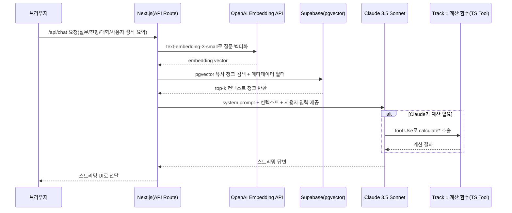

# System Design: univ (가족 전용 AI 대입 컨설팅)

PRD P1-11~14·P2-6~8 반영 스키마/Track1·2 확장 요약은 [`docs/02_SYSTEM_ARCHITECTURE.md`](./02_SYSTEM_ARCHITECTURE.md)를 참조합니다.

## 1) 시스템 전체 구조 (High-Level Architecture)

핵심 경로는 다음과 같습니다.

```mermaid
flowchart LR
  U[브라우저(아빠/아들/엄마)] --> N[Next.js(App Router, Vercel)]
  N --> S[Supabase(PostgreSQL + pgvector)]
  N --> C1[OpenAI Embedding API]
  N --> C2[Claude 3.5 Sonnet API]
  C2 --> N
  C1 --> N
  N --> U
```

설명 요약:
- **Track 1(정량 계산)**: Next.js 서버의 `TypeScript 순수 함수`로 계산되며 LLM/AI API를 호출하지 않습니다.
- **Track 2(RAG/LLM)**: `OpenAI 임베딩(질문 벡터화) + Supabase pgvector 유사 청크 검색` 후, `Claude 3.5 Sonnet`이 컨텍스트 기반으로 답변합니다.

## 2) 투 트랙 엔진 설계 (Two-Track Engine)

PRD의 엔진 역할을 코드 레벨에서 완전히 분리합니다.

---

### 2.1 Track 1: 정량 계산 엔진 (Deterministic Engine)

담당 기능:
- `학생부교과` 내신 환산 (`calculateSusiGPA`)
- `정시` 수능 환산점수 (`calculateSuneungScore`)
- `Z점수` 산출 (`calculateZScore`)
- `합격 가능성` 신호등 점수 비교/판정 (`calculateAdmissionProbability`)

구현 위치:
- `src/lib/calculators/` 디렉토리 하위
- 모든 함수는 **TypeScript 순수 함수**(입력 -> 출력, 외부 부수효과 없음)로 구현

핵심 원칙:
- LLM이 직접 수치 계산을 수행하지 않습니다.
- Claude는 필요할 때만 Tool Use로 Track 1 함수를 호출합니다(결과값은 Tool 응답으로만 사용).

주요 함수 목록(시그니처):
- `calculateSuneungScore(scores: SuneungScores, rules: SuneungRules): SuneungScoreResult`
- `calculateSusiGPA(records: SusiRecords, rules: SusiRules): SusiGPAResult`
- `calculateZScore(rawScore: number, mean: number, stddev: number): number`
- `calculateAdmissionProbability(score: number, cutline: number, discountFactor?: number): AdmissionProbabilityResult`

구현 시 세부 계약(권장):
- `rules`는 연도/대학/전형 기준으로 버전 관리된 설정값을 사용합니다.
- `cutline` 비교 로직에는 `discountFactor`를 포함(의대 증원 연쇄 이동 보정 계수)합니다.

---

### 2.2 Track 2: RAG 엔진 (Intelligence Engine)

담당 기능:
- 요강 챗봇 (RAG 질의응답)
- 학생부종합 정성 분석 (생기부 역량 분석)
- 세특 Gap Analysis 및 학종 액션 플랜 제안
- 논술전형 실질 경쟁률 해석(최저 충족 판단 포함 설명)

구현 위치:
- `src/app/api/chat/route.ts`
- 스트리밍 응답을 지원(Claude 스트리밍 + 클라이언트 SSE/Fetch 스트림)

RAG 파이프라인 흐름(요구사항 기반):
1. 사용자 질문/요청 페이로드 수신
2. OpenAI `text-embedding-3-small`로 질문 벡터화
3. Supabase pgvector에서 유사 청크 검색 수행
   - 메타데이터 필터: `university_name`, `admission_type`, `year` 등 PRD 기반 필수 조건
4. 검색된 컨텍스트(청크 텍스트 + 메타데이터)와 함께 아들 성적/사용자 입력 요약을 구성
5. Claude 3.5 Sonnet에 프롬프트/컨텍스트 전달
6. Claude는 필요 시 Tool Use로 Track 1 계산 함수를 호출
7. 최종 답변을 스트리밍 반환

중요한 제한:
- 근거 문단이 없거나 메타데이터 필터 불일치면 답변 품질 정책에 따라 `확인 불가` 응답
- 숫자 계산 결과는 Tool(Track 1) 응답만 사용

Mermaid 시퀀스 다이어그램(요구사항 흐름):



## 3) 전형별 데이터 처리 흐름

텍스트 + 표로 충분하므로 도식은 생략합니다.

| 전형 | 입력 데이터 | 처리 엔진 | 출력 |
|---|---|---|---|
| `학생부교과` | 과목별 원점수/단위수/등급/성취도 + 대학 반영 교과/환산 규칙 | Track 1(`calculateSusiGPA`) | 대학별 실질 내신 등급 |
| `학생부종합` | 생기부 세특 텍스트(업로드/정제된 텍스트) | Track 2(RAG + Claude) (+ 필요 시 Tool Use로 참고 계산) | 역량 분석 리포트, 세특 주제 제안 |
| `논술전형` | (예시) 모의고사 등급/관련 입력 + 대학별 최저 기준/조건 | Track 1(최저 충족 판정 및 실질 경쟁률 구성) + Track 2(해석/설명) | 최저 충족 여부 + 실질 경쟁률(및 해석) |
| `정시` | 수능 표준점수/백분위 + 영어 등급 환산 기준 + 탐구 변환표준점수 + 반영비율 + 과탐II 가산점 | Track 1(`calculateSuneungScore`) (+ 합격 신호등) | 대학별 환산점수 + 합격 가능성 |
| (참고) `Z점수 기반 고교 수준` | 과목별 원점수/평균/표준편차/수강자수 | Track 1(`calculateZScore`) | 학교 수준 해석용 참고지표 |

## 4) 보안 설계

요구사항을 구현 레벨로 분해합니다.

### 4.1 Supabase RLS 정책(기본 원칙)
- 각 테이블에 `family_id` 또는 `student_id` 스코프 필드를 보유
- RLS에서 다음 조건을 강제합니다.
  - 예: `auth.uid() = student_id` (요구사항 기준)
  - 또는 가족 공유 모델이면 `auth.uid() IN (family_members)` 형태의 `family_id` 스코프
- 결과적으로:
  - Viewer는 자신의 가족 데이터 열람만 가능
  - Admin은 자신의 가족 데이터 수정/관리만 가능

### 4.2 API Route 보호
- 서버 사이드에서 Supabase 세션 토큰 검증 미들웨어를 적용합니다.
- 구현 위치(권장):
  - `src/middleware.ts`에서 요청 인증/권한 검사
- 보호 항목:
  - `/api/chat` : Viewer/다른 역할의 접근 범위 제어
  - `/api/scores` : Admin-only write, Viewer read-only
  - `/api/analysis` : Admin/Viewer 권한 구분(예: 분석 저장/생성은 Admin)

### 4.3 환경변수 관리
- `.env.local`에만 API 키 저장
- `.env.local.example`에는 키를 포함하지 않고 변수명만 노출
- 서버에서만 호출(프론트로 API 키 노출 금지)

## 5) 디렉토리 구조 (File Structure)

요구사항의 기준 트리를 그대로 반영합니다.

```txt
univ4/app/
├── src/
│   ├── app/
│   │   ├── (auth)/          # 로그인/회원가입
│   │   ├── dashboard/       # 성적 대시보드
│   │   ├── chat/             # AI 요강 챗봇
│   │   ├── calendar/       # 입시 캘린더
│   │   └── api/
│   │       ├── chat/       # RAG 챗봇 API Route
│   │       ├── scores/     # 성적 CRUD
│   │       └── analysis/   # 합격 가능성 분석
│   ├── lib/
│   │   ├── calculators/    # Track 1 계산 함수
│   │   ├── supabase/       # Supabase 클라이언트
│   │   └── prompts/        # Claude 시스템 프롬프트 모음
│   └── components/         # Shadcn UI 기반 공통 컴포넌트
├── scripts/
│   └── ingest/             # PDF 파싱 + 임베딩 적재 1회성 스크립트
├── supabase/
│   └── migrations/        # DB 스키마 SQL 버전 관리
└── docs/                   # 설계 문서
```

## 6) 비용 추정 (월간)

아래 비용은 **MVP 초기사용 패턴(가족 3인, 챗봇 월 10회 내외 + 요강 임베딩 1회성)** 가정입니다.

| 항목 | 서비스 | 예상 비용 |
|---|---|---|
| 웹 호스팅 | Vercel Free Tier | $0 |
| 데이터베이스 | Supabase Free Tier | $0 |
| PDF 임베딩 (1회성) | OpenAI Embedding (요강 3개 대학) | ~$0.01 |
| 챗봇 사용 | Claude 3.5 Sonnet API (가족 3인, 일 10회 수준으로 제한) | ~$3~5 |
| 합계 |  | 월 $5 이내 |

비용 통제를 위한 운영 장치:
- `Top-k` 컨텍스트 크기 제한(토큰 절감)
- 동일 문서/질문 조합 캐싱
- 일일 호출 하드캡 및 운영 알림(초과 방지)

