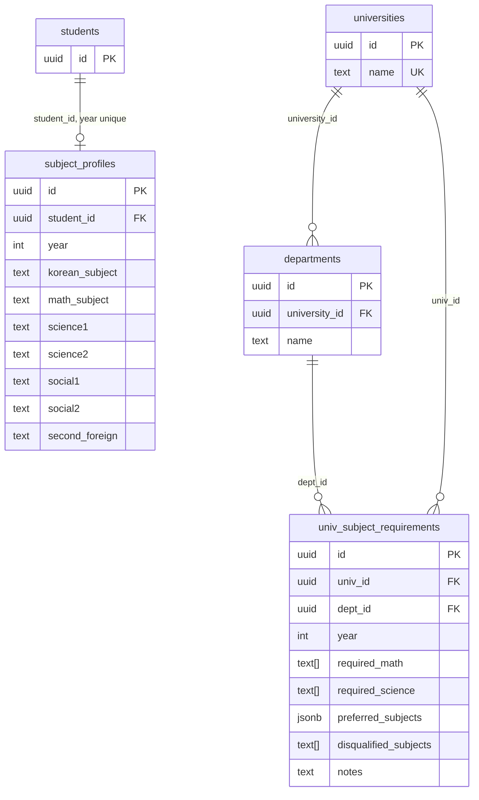

# Data Model: P1-11 선택과목·대학 요건

상위 개요·기존 테이블 정의는 [`docs/03_DB_SCHEMA.md`](./03_DB_SCHEMA.md)를 참조합니다.  
본 문서는 **`subject_profiles`**, **`univ_subject_requirements`** 및 FK용 **`universities`**, **`departments`**의 컬럼·제약·RLS를 상세 정의합니다.

실제 DDL: `supabase/migrations/20260327000000_subject_profiles.sql`

---

## 1) ERD (관계)

---

## 2) `subject_profiles`

| 컬럼명 | 타입 | 제약 | 설명 |
|---|---|---|---|
| id | uuid | PK, default `gen_random_uuid()` | 행 식별자 |
| student_id | uuid | FK → `students(id)` ON DELETE CASCADE, not null | 학생 |
| year | integer | not null, default 2027, **check (year = 2027)** | 입시 기준 연도 |
| korean_subject | text | not null, check in (`언어와매체`, `화법과작문`) | 국어 선택과목 |
| math_subject | text | not null, check in (`미적분`, `기하`, `확률과통계`) | 수학 선택과목 |
| science1 | text | nullable | 탐구 과목명 |
| science2 | text | nullable | 탐구 과목명 |
| social1 | text | nullable | 탐구 과목명 |
| social2 | text | nullable | 탐구 과목명 |
| second_foreign | text | nullable | 제2외국어 |
| created_at | timestamptz | not null, default now() | |
| updated_at | timestamptz | not null, default now() | |

- **고유 제약**: `unique (student_id, year)` — 학생당 연도별 1행
- **RLS**: 활성화. SELECT/INSERT/UPDATE/DELETE 모두 `auth.uid() = student_id`

---

## 3) `univ_subject_requirements`

| 컬럼명 | 타입 | 제약 | 설명 |
|---|---|---|---|
| id | uuid | PK, default `gen_random_uuid()` | 행 식별자 |
| univ_id | uuid | FK → `universities(id)` ON DELETE CASCADE, not null | 대학 |
| dept_id | uuid | FK → `departments(id)` ON DELETE CASCADE, not null | 모집단위(학과) |
| year | integer | not null, default 2027, **check (year = 2027)** | 학년도 |
| required_math | text[] | nullable | 필수 수학(허용 나열). null/빈 배열 = 제한 없음 |
| required_science | text[] | nullable | 필수 탐구 과목명 |
| preferred_subjects | jsonb | not null, default `{}` | 우대·가산 조건 |
| disqualified_subjects | text[] | nullable | 해당 과목/유형 선택 시 지원 불가 |
| notes | text | nullable | 비고 |
| created_at | timestamptz | not null, default now() | |
| updated_at | timestamptz | not null, default now() | |

- **RLS**: 활성화. SELECT `auth.role() = 'authenticated'` (읽기 전용 참조)

---

## 4) `universities` / `departments` (요약)

| 테이블 | 핵심 컬럼 | RLS |
|---|---|---|
| universities | id PK, name unique, timestamps | authenticated SELECT |
| departments | id PK, university_id FK, name, unique(university_id, name) | authenticated SELECT |

---

## 5) 타입스크립트 타입 (참고)

앱 계층 타입: `src/types/subject.ts` (`SubjectProfile`, `UnivSubjectRequirement`, `University`)

---

## 6) CI 문서 동기화

GitHub Actions `doc-sync-check`는 `supabase/migrations/*.sql` 중 **`docs/03_DATA_MODEL.md`보다 최근에 수정된 파일**이 있으면 실패합니다. 마이그레이션을 추가·변경한 커밋에서는 반드시 본 문서를 함께 갱신하세요.
