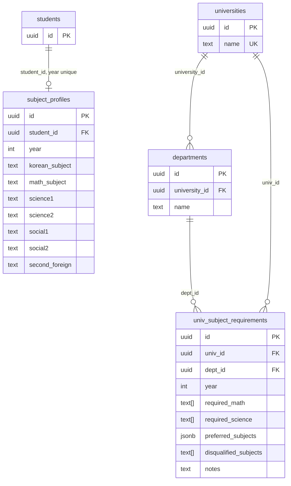

# Data Model: P1-11 선택과목·대학 요건 + PRD v2 확장 예정

**근거 PRD**: [`docs/01_PRD_v2.md`](./01_PRD_v2.md) · **로드맵**: [`docs/05_ROADMAP.md`](./05_ROADMAP.md)

상위 개요·기존 테이블 정의는 [`docs/03_DB_SCHEMA.md`](./03_DB_SCHEMA.md)를 참조합니다.  
본 문서는 **`subject_profiles`**, **`univ_subject_requirements`** 및 FK용 **`universities`**, **`departments`**의 컬럼·제약·RLS를 상세 정의합니다.

실제 DDL: `supabase/migrations/20260327000000_subject_profiles.sql`

**RAG·챗봇 한도**: `guideline_chunks` 검색 RPC(`match_guideline_chunks`, `match_threshold` 포함), 생기부 `student_record_chunks`·`match_student_record_chunks`, 및 `chat_usage_daily` / `try_consume_chat_quota`는 [`docs/03_DB_SCHEMA.md`](./03_DB_SCHEMA.md) §2.17·§2.18 및 마이그레이션 `20260329120000_chat_rag.sql`, `20260329140000_match_guideline_chunks_threshold.sql`, `20260330250000_student_record_chunks.sql`을 참조.

---

## PRD v2 — `university_search_index` (가칭 · 스펙 확정 전)

- **목적**: P1-15 전국 탐색기, P1-16 조건부 필터에서 사용할 **검색·필터 단위** 행(대학·전형·모집단위 등)을 통일된 형태로 노출.
- **입력 소스(예시)**: 어디가 입결 199개(`admission_db.json` 또는 동기화 테이블), 18개 대학 전형계획 파싱 필드(수능최저·면접·교과 반영 비율 등).
- **형태**: `VIEW`로 조인만 노출할지, **물리 테이블 + 적재 배치**할지는 데이터 갱신 주기(연 1회 등)에 따라 `03_DB_SCHEMA.md` §7과 함께 결정.
- **구현 전**: 컬럼 목록·FK는 마이그레이션 작성 시 본 절에 반영한다.

---

## 1) ERD (관계)

---

## 2) `subject_profiles`

| 컬럼명 | 타입 | 제약 | 설명 |
|---|---|---|---|
| id | uuid | PK, default `gen_random_uuid()` | 행 식별자 |
| student_id | uuid | FK → `students(id)` ON DELETE CASCADE, not null | 학생 |
| year | integer | not null, default 2027, **check (year = 2027)** | 입시 기준 연도 |
| korean_subject | text | not null, check in (`언어와매체`, `화법과작문`) | 국어 선택과목 |
| math_subject | text | not null, check in (`미적분`, `기하`, `확률과통계`) | 수학 선택과목 |
| science1 | text | nullable | 탐구 과목명 |
| science2 | text | nullable | 탐구 과목명 |
| social1 | text | nullable | 탐구 과목명 |
| social2 | text | nullable | 탐구 과목명 |
| second_foreign | text | nullable | 제2외국어 |
| created_at | timestamptz | not null, default now() | |
| updated_at | timestamptz | not null, default now() | |

- **고유 제약**: `unique (student_id, year)` — 학생당 연도별 1행
- **RLS**: 활성화. SELECT/INSERT/UPDATE/DELETE 모두 `auth.uid() = student_id`

---

## 3) `univ_subject_requirements`

| 컬럼명 | 타입 | 제약 | 설명 |
|---|---|---|---|
| id | uuid | PK, default `gen_random_uuid()` | 행 식별자 |
| univ_id | uuid | FK → `universities(id)` ON DELETE CASCADE, not null | 대학 |
| dept_id | uuid | FK → `departments(id)` ON DELETE CASCADE, not null | 모집단위(학과) |
| year | integer | not null, default 2027, **check (year = 2027)** | 학년도 |
| required_math | text[] | nullable | 필수 수학(허용 나열). null/빈 배열 = 제한 없음 |
| required_science | text[] | nullable | 필수 탐구 과목명 |
| preferred_subjects | jsonb | not null, default `{}` | 우대·가산 조건 |
| disqualified_subjects | text[] | nullable | 해당 과목/유형 선택 시 지원 불가 |
| notes | text | nullable | 비고 |
| created_at | timestamptz | not null, default now() | |
| updated_at | timestamptz | not null, default now() | |

- **RLS**: 활성화. SELECT `auth.role() = 'authenticated'` (읽기 전용 참조)

---

## 4) `universities` / `departments` (요약)

| 테이블 | 핵심 컬럼 | RLS |
|---|---|---|
| universities | id PK, name unique, timestamps | authenticated SELECT |
| departments | id PK, university_id FK, name, unique(university_id, name) | authenticated SELECT |

### `admission_records`

data-collector `admission_db.jsonl` 적재용 물리 테이블. 컬럼·UNIQUE·RLS는 [`docs/03_DB_SCHEMA.md`](./03_DB_SCHEMA.md) §2.13, 최종 DDL은 `supabase/migrations/20260329000002_admission_records.sql`을 따른다(이전 `20260329000001` 초안은 `00002`에서 교체됨). `admission_type`에 **`논술전형`**은 `supabase/migrations/20260330240000_admission_records_nulsul_type.sql`에서 CHECK 제약으로 허용되며, 적재 스크립트 `scripts/ingest/load_admission_db.ts`의 허용 집합과 맞춘다(P1-3 실질 경쟁률·`GET /api/nulsul`).

### `susi_gpa_rules` (P1-16 보강)

학생부교과·종합 등 반영 규칙 테이블. 상세 DDL·컬럼 표는 [`docs/03_DB_SCHEMA.md`](./03_DB_SCHEMA.md) §2.5. **`interview_required`**(boolean, nullable)는 `supabase/migrations/20260330230000_susi_gpa_rules_interview_required.sql`에서 추가되며, `GET /api/explore` 면접 필터에 사용한다. null은 요강 미연동·미상을 뜻한다.

### `academic_records` (NEIS 내신 필드 확장)

마이그레이션 `supabase/migrations/20260329140000_academic_records_neis.sql`에서 내신 행에 `semester`, `subject_category`, `total_score`, `class_rank`, `rank_total` 컬럼을 추가한다. 컬럼 정의·제약은 [`docs/03_DB_SCHEMA.md`](./03_DB_SCHEMA.md) §2.2를 따른다.

NEIS 파싱 JSON 적재 스크립트 `scripts/ingest/load_neis_grades.ts`의 upsert 키는 `supabase/migrations/20260329170000_academic_records_fix_unique.sql`에서 정의한 **`academic_records_upsert_key`**: `UNIQUE (student_id, semester, subject_name, credit_unit)`와 대응한다(선행 `20260329150000`의 부분 유니크 인덱스는 이 마이그레이션에서 제거됨 — Postgres·Supabase `ON CONFLICT`는 부분 인덱스를 대상으로 할 수 없음).

### NEIS 생활기록부 구조화 테이블 (`student_awards` 등)

마이그레이션 `supabase/migrations/20260329160000_student_record_tables.sql`에서 7테이블을 추가하고, `supabase/migrations/20260330190000_student_certificates_school_violence.sql`에서 `student_certificates`, `student_school_violence`를 추가한다. 컬럼·UNIQUE·RLS·적재 스크립트는 [`docs/03_DB_SCHEMA.md`](./03_DB_SCHEMA.md) §2.15, 도메인 스펙은 [`docs/08_STUDENT_RECORD_SPEC.md`](./08_STUDENT_RECORD_SPEC.md)를 따른다.

| 테이블 | 요약 |
|---|---|
| `student_awards` | 수상경력 — `created_at` 포함 |
| `student_attendance` | 출결 — 학년별 1행, `unique (student_id, grade)` |
| `student_activities` | 창체 — `unique (student_id, grade, activity_type)` |
| `student_volunteer` | 봉사 — 다건 |
| `student_subject_notes` | 세특 — `unique (student_id, grade, semester, subject_name)` |
| `student_reading` | 독서 — 다건 |
| `student_behavior` | 행동특성 — `unique (student_id, grade)` |
| `student_certificates` | 자격증·인증 — 다건, `created_at` |
| `student_school_violence` | 학교폭력 조치 — 다건, `created_at` |

- **적재**: `scripts/ingest/load_student_record.ts` — `record/student_record.json` → 위 9테이블. 검증 배치(2026-03-29): `student_attendance` 3건, `student_awards` 3건, `student_activities` 6건, `student_volunteer` 14건, `student_subject_notes` 23건, `student_behavior` 2건(`student_reading`은 해당 배치에서 미적재 또는 0건).
- **RLS**: SELECT는 본인 `student_id` 또는 `students.role = 'admin'`; INSERT/UPDATE/DELETE는 admin만(§2.15와 동일).

### `student_record_chunks` (생활기록부 RAG)

마이그레이션 `supabase/migrations/20260330250000_student_record_chunks.sql`. 세특(`student_subject_notes`)·창체(`student_activities`)·행동특성(`student_behavior`) 텍스트를 청크·임베딩하여 `guideline_chunks`와 분리 저장한다. DDL·RLS·RPC는 [`docs/03_DB_SCHEMA.md`](./03_DB_SCHEMA.md) §2.18.

- **적재**: `scripts/ingest/embed_student_record.ts` — `NEIS_STUDENT_ID`(선택, 미설정 시 `auth.users` 첫 사용자)·`OPENAI_API_KEY`·서비스 키 필요. 실행 순서는 [`scripts/ingest/README.md`](../scripts/ingest/README.md) 참조.

---

## 5) 타입스크립트 타입 (참고)

앱 계층 타입: `src/types/subject.ts` (`SubjectProfile`, `UnivSubjectRequirement`, `University`)

---

## 6) `calendar_events` (P0-5 가족 공용 입시 캘린더)

실제 DDL: `supabase/migrations/20260330180000_calendar_events.sql`

| 컬럼명 | 타입 | 제약 | 설명 |
|---|---|---|---|
| id | uuid | PK, default `gen_random_uuid()` | |
| student_id | uuid | FK → `students(id)` ON DELETE CASCADE, not null | 본인 계정과 동일한 UUID |
| title | text | not null | 일정 제목 |
| event_date | date | not null | 일정 날짜 |
| event_type | text | not null, check in (`원서접수`, `수능`, `정시`, `면접`, `논술`, `기타`) | |
| university | text | nullable | 대학명(선택) |
| alert_days | integer[] | not null, default `{7,3,1,0}` | 알림 기준일(일 전) |
| note | text | nullable | 메모 |
| created_at | timestamptz | not null, default now() | |

- **인덱스**: `(student_id, event_date)`
- **RLS**: SELECT는 `auth.role() = 'authenticated'` 이고 `auth.uid() = student_id`. INSERT/UPDATE/DELETE는 동일 `student_id`이면서 `students.role = 'admin'`인 경우만.
- **기본 일정**: RPC `ensure_default_admission_calendar_2027()` — `ADMISSION_SCHEDULE_2027`와 동일한 4건(제목+날짜)이 없을 때만 삽입(학생별 idempotent).

---

## 7) `simulator_portfolios` (P1-7 원서 배분 시뮬레이터)

실제 DDL: `supabase/migrations/20260330210000_simulator_portfolios.sql`

| 컬럼명 | 타입 | 제약 | 설명 |
|---|---|---|---|
| id | uuid | PK, default `gen_random_uuid()` | |
| student_id | uuid | FK → `students(id)` ON DELETE CASCADE, not null | 본인 계정 UUID |
| cards | jsonb | not null, default `[]` | 카드 배열(대학·학과·전형·신호등·수능최저 여부 등). 앱 스키마는 `POST /api/simulator`와 동일 |
| created_at | timestamptz | not null, default now() | |

- **고유**: `unique (student_id)` — 학생당 1행(upsert 저장)
- **RLS**: SELECT/INSERT/UPDATE/DELETE 모두 `auth.uid() = student_id`

---

## 8) CI 문서 동기화

GitHub Actions `doc-sync-check`는 `supabase/migrations/*.sql` 중 **`docs/03_DATA_MODEL.md`보다 최근에 수정된 파일**이 있으면 실패합니다. 마이그레이션을 추가·변경한 커밋에서는 반드시 본 문서를 함께 갱신하세요.

**현재 마이그레이션 파일 목록 (17개, `find supabase/migrations -name "*.sql" | sort` 기준)**

| 순서 | 파일명 |
| ---: | --- |
| 1 | `20260325000000_init.sql` |
| 2 | `20260326000000_multi_student.sql` |
| 3 | `20260327000000_subject_profiles.sql` |
| 4 | `20260329000001_admission_records.sql` |
| 5 | `20260329000002_admission_records.sql` |
| 6 | `20260329120000_chat_rag.sql` |
| 7 | `20260329140000_academic_records_neis.sql` |
| 8 | `20260329140000_match_guideline_chunks_threshold.sql` |
| 9 | `20260329150000_academic_records_neis_upsert_unique.sql` |
| 10 | `20260329160000_student_record_tables.sql` |
| 11 | `20260329170000_academic_records_fix_unique.sql` |
| 12 | `20260330180000_calendar_events.sql` |
| 13 | `20260330190000_student_certificates_school_violence.sql` |
| 14 | `20260330210000_simulator_portfolios.sql` |
| 15 | `20260330230000_susi_gpa_rules_interview_required.sql` |
| 16 | `20260330240000_admission_records_nulsul_type.sql` |
| 17 | `20260330250000_student_record_chunks.sql` |
