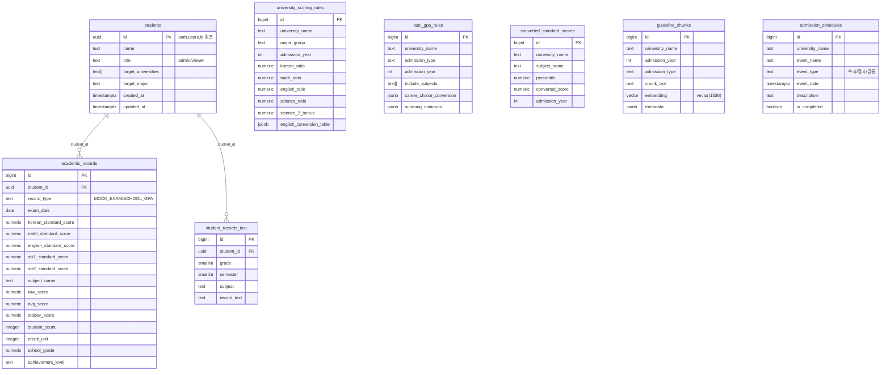

# DB Schema Design (Supabase PostgreSQL + pgvector)

`docs/01_PRD.md`, `docs/02_SYSTEM_DESIGN.md`를 기준으로 작성한 DB 설계 문서입니다.  
실제 적용 SQL은 `supabase/migrations/20260325000000_init.sql`에 동일하게 포함되어 있으며, Supabase SQL Editor에서 바로 실행 가능합니다.

## 1) ER 다이어그램



## 2) 테이블별 상세 정의

각 테이블 SQL은 `supabase/migrations/20260325000000_init.sql`에 저장 예정(동일 내용 반영 완료)입니다.

---

### 2.1 `students`

- 목적: 가족 사용자 기본 프로필 및 권한 저장

| 컬럼명 | 타입 | 제약조건 | 설명 |
|---|---|---|---|
| id | uuid | PK, FK -> auth.users(id), not null | 사용자 식별자 |
| name | text | not null | 이름 |
| role | text | not null, check(admin/viewer) | 역할 |
| target_universities | text[] | not null, default '{}' | 목표 대학 목록 |
| target_major | text | nullable | 목표 전공 |
| created_at | timestamptz | not null, default now() | 생성 시각 |
| updated_at | timestamptz | not null, default now() | 수정 시각 |

```sql
create table if not exists public.students (
  id uuid primary key references auth.users(id) on delete cascade,
  name text not null,
  role text not null check (role in ('admin', 'viewer')),
  target_universities text[] not null default '{}',
  target_major text,
  created_at timestamptz not null default now(),
  updated_at timestamptz not null default now()
);
```

---

### 2.2 `academic_records`

- 목적: 모의고사/내신 원천 데이터를 단일 테이블로 저장 (`record_type`으로 구분)

| 컬럼명 | 타입 | 제약조건 | 설명 |
|---|---|---|---|
| id | bigint | PK, identity | 레코드 식별자 |
| student_id | uuid | FK -> students(id), not null | 학생 식별자 |
| record_type | text | not null, check(MOCK_EXAM/SCHOOL_GPA) | 성적 유형 |
| exam_date | date | not null | 시험/학기 기준일 |
| korean_standard_score ~ sci2_grade | numeric/smallint | nullable | 모의고사 영역별 표준점수/백분위/등급 |
| subject_name | text | nullable | 내신 과목명 |
| raw_score | numeric(5,2) | nullable | 원점수 |
| avg_score | numeric(5,2) | nullable | 평균 |
| stddev_score | numeric(5,2) | nullable | 표준편차 |
| student_count | integer | nullable | 수강자수 |
| credit_unit | integer | nullable | 단위수 |
| school_grade | numeric(3,1) | nullable | 과목 등급 |
| achievement_level | text | nullable, check(A~E) | 성취도 |
| created_at | timestamptz | not null, default now() | 생성 시각 |

> `record_type`에 따라 관련 없는 컬럼은 nullable로 유지합니다.

```sql
create table if not exists public.academic_records (
  id bigint generated always as identity primary key,
  student_id uuid not null references public.students(id) on delete cascade,
  record_type text not null check (record_type in ('MOCK_EXAM', 'SCHOOL_GPA')),
  exam_date date not null,
  korean_standard_score numeric(5,2),
  korean_percentile numeric(5,2),
  korean_grade smallint,
  math_standard_score numeric(5,2),
  math_percentile numeric(5,2),
  math_grade smallint,
  english_standard_score numeric(5,2),
  english_percentile numeric(5,2),
  english_grade smallint,
  sci1_standard_score numeric(5,2),
  sci1_percentile numeric(5,2),
  sci1_grade smallint,
  sci2_standard_score numeric(5,2),
  sci2_percentile numeric(5,2),
  sci2_grade smallint,
  subject_name text,
  raw_score numeric(5,2),
  avg_score numeric(5,2),
  stddev_score numeric(5,2),
  student_count integer,
  credit_unit integer,
  school_grade numeric(3,1),
  achievement_level text check (achievement_level in ('A', 'B', 'C', 'D', 'E')),
  created_at timestamptz not null default now()
);
```

---

### 2.3 `student_records_text`

- 목적: 학생부종합 RAG 분석용 생기부/세특 원문 저장

| 컬럼명 | 타입 | 제약조건 | 설명 |
|---|---|---|---|
| id | bigint | PK, identity | 레코드 식별자 |
| student_id | uuid | FK -> students(id), not null | 학생 식별자 |
| grade | smallint | not null, check(1/2/3) | 학년 |
| semester | smallint | not null, check(1/2) | 학기 |
| subject | text | not null | 과목 |
| record_text | text | not null | 세특 원문 |
| created_at | timestamptz | not null, default now() | 생성 시각 |

```sql
create table if not exists public.student_records_text (
  id bigint generated always as identity primary key,
  student_id uuid not null references public.students(id) on delete cascade,
  grade smallint not null check (grade in (1, 2, 3)),
  semester smallint not null check (semester in (1, 2)),
  subject text not null,
  record_text text not null,
  created_at timestamptz not null default now()
);
```

---

### 2.4 `university_scoring_rules`

- 목적: 정시 수능 반영 규칙 저장

| 컬럼명 | 타입 | 제약조건 | 설명 |
|---|---|---|---|
| id | bigint | PK, identity | 규칙 식별자 |
| university_name | text | not null | 대학명 |
| major_group | text | not null | 계열/모집군 |
| admission_year | integer | not null | 학년도 |
| korean_ratio | numeric(6,3) | not null | 국어 반영비율 |
| math_ratio | numeric(6,3) | not null | 수학 반영비율 |
| english_ratio | numeric(6,3) | not null | 영어 반영비율 |
| science_ratio | numeric(6,3) | not null | 과학 반영비율 |
| science_2_bonus | numeric(6,3) | not null, default 0 | 과탐II 가산점 비율 |
| english_conversion_table | jsonb | not null | 영어 등급별 환산점수 |
| created_at | timestamptz | not null, default now() | 생성 시각 |

```sql
create table if not exists public.university_scoring_rules (
  id bigint generated always as identity primary key,
  university_name text not null,
  major_group text not null,
  admission_year integer not null,
  korean_ratio numeric(6,3) not null,
  math_ratio numeric(6,3) not null,
  english_ratio numeric(6,3) not null,
  science_ratio numeric(6,3) not null,
  science_2_bonus numeric(6,3) not null default 0,
  english_conversion_table jsonb not null,
  created_at timestamptz not null default now(),
  unique (university_name, major_group, admission_year)
);
```

---

### 2.5 `susi_gpa_rules`

- 목적: 학생부교과전형 내신 산출 규칙 저장

| 컬럼명 | 타입 | 제약조건 | 설명 |
|---|---|---|---|
| id | bigint | PK, identity | 규칙 식별자 |
| university_name | text | not null | 대학명 |
| admission_type | text | not null, check(학생부교과/학생부종합/논술전형/정시) | 전형명 |
| admission_year | integer | not null | 학년도 |
| include_subjects | text[] | not null, default '{}' | 반영 교과목 목록 |
| career_choice_conversion | jsonb | not null | 진로선택 성취도 환산 |
| suneung_minimum | jsonb | nullable | 수능 최저학력기준 |
| created_at | timestamptz | not null, default now() | 생성 시각 |

```sql
create table if not exists public.susi_gpa_rules (
  id bigint generated always as identity primary key,
  university_name text not null,
  admission_type text not null check (admission_type in ('학생부교과', '학생부종합', '논술전형', '정시')),
  admission_year integer not null,
  include_subjects text[] not null default '{}',
  career_choice_conversion jsonb not null,
  suneung_minimum jsonb,
  created_at timestamptz not null default now(),
  unique (university_name, admission_type, admission_year)
);
```

---

### 2.6 `converted_standard_scores`

- 목적: 수능 후 대학별 탐구영역 변환표준점수표 저장

| 컬럼명 | 타입 | 제약조건 | 설명 |
|---|---|---|---|
| id | bigint | PK, identity | 레코드 식별자 |
| university_name | text | not null | 대학명 |
| subject_name | text | not null | 과목명 |
| percentile | numeric(5,2) | not null | 백분위 |
| converted_score | numeric(6,2) | not null | 변환표준점수 |
| admission_year | integer | not null | 학년도 |
| created_at | timestamptz | not null, default now() | 생성 시각 |

```sql
create table if not exists public.converted_standard_scores (
  id bigint generated always as identity primary key,
  university_name text not null,
  subject_name text not null,
  percentile numeric(5,2) not null,
  converted_score numeric(6,2) not null,
  admission_year integer not null,
  created_at timestamptz not null default now(),
  unique (university_name, subject_name, percentile, admission_year)
);

comment on table public.converted_standard_scores is
  '수능 성적 발표 후 대학별 탐구영역 변환표준점수를 일괄 적재하는 테이블';
```

---

### 2.7 `guideline_chunks`

- 목적: RAG 검색용 요강 청크 + 임베딩 벡터 저장

| 컬럼명 | 타입 | 제약조건 | 설명 |
|---|---|---|---|
| id | bigint | PK, identity | 청크 식별자 |
| university_name | text | not null | 대학명 |
| admission_year | integer | not null | 학년도 |
| admission_type | text | not null, check(학생부교과/학생부종합/논술전형/정시) | 전형 |
| chunk_text | text | not null | 청크 본문 |
| embedding | vector(1536) | not null | 임베딩 벡터(OpenAI `text-embedding-3-small`, 1536차원) |
| metadata | jsonb | not null, default '{}' | 부가 메타데이터 |
| created_at | timestamptz | not null, default now() | 생성 시각 |

```sql
create table if not exists public.guideline_chunks (
  id bigint generated always as identity primary key,
  university_name text not null,
  admission_year integer not null,
  admission_type text not null check (admission_type in ('학생부교과', '학생부종합', '논술전형', '정시')),
  chunk_text text not null,
  embedding vector(1536) not null,
  metadata jsonb not null default '{}'::jsonb,
  created_at timestamptz not null default now()
);
```

---

### 2.8 `admission_schedules`

- 목적: 가족 공용 입시 일정 저장

| 컬럼명 | 타입 | 제약조건 | 설명 |
|---|---|---|---|
| id | bigint | PK, identity | 일정 식별자 |
| university_name | text | not null | 대학명 |
| event_name | text | not null | 이벤트명 |
| event_type | text | not null, check(수시/정시/공통) | 이벤트 분류 |
| event_date | timestamptz | not null | 일정 일시 |
| description | text | nullable | 상세 설명 |
| is_completed | boolean | not null, default false | 완료 여부 |
| created_at | timestamptz | not null, default now() | 생성 시각 |

```sql
create table if not exists public.admission_schedules (
  id bigint generated always as identity primary key,
  university_name text not null,
  event_name text not null,
  event_type text not null check (event_type in ('수시', '정시', '공통')),
  event_date timestamptz not null,
  description text,
  is_completed boolean not null default false,
  created_at timestamptz not null default now()
);
```

## 3) pgvector 설정 및 인덱스

```sql
create extension if not exists vector;
```

`guideline_chunks` 벡터 검색 인덱스:

```sql
create index if not exists guideline_chunks_embedding_hnsw_idx
  on public.guideline_chunks using hnsw (embedding vector_cosine_ops);
```

추가 메타 인덱스:

```sql
create index if not exists idx_guideline_chunks_meta
  on public.guideline_chunks(university_name, admission_year, admission_type);
```

HNSW 선택 이유(요약):
- IVFFlat 대비 근사 최근접 탐색 정확도가 높고, 소규모-중규모 문서셋에서 질의 품질이 안정적입니다.
- 초기 인덱스 생성 비용은 더 들 수 있으나, 본 프로젝트는 조회 정확도를 우선합니다.

## 4) RLS(Row Level Security) 정책

아래 정책 SQL은 `supabase/migrations/20260325000000_init.sql`에 포함됩니다.

```sql
alter table public.students enable row level security;
alter table public.academic_records enable row level security;
alter table public.student_records_text enable row level security;
alter table public.university_scoring_rules enable row level security;
alter table public.susi_gpa_rules enable row level security;
alter table public.converted_standard_scores enable row level security;
alter table public.guideline_chunks enable row level security;
alter table public.admission_schedules enable row level security;

-- students: 본인 row만 조회/수정 가능
create policy students_select_own on public.students
  for select using (auth.uid() = id);
create policy students_update_own on public.students
  for update using (auth.uid() = id)
  with check (auth.uid() = id);
create policy students_insert_self on public.students
  for insert with check (auth.uid() = id);

-- academic_records: 본인 student_id row만 접근
create policy academic_records_select_own on public.academic_records
  for select using (auth.uid() = student_id);
create policy academic_records_insert_own on public.academic_records
  for insert with check (auth.uid() = student_id);
create policy academic_records_update_own on public.academic_records
  for update using (auth.uid() = student_id)
  with check (auth.uid() = student_id);
create policy academic_records_delete_own on public.academic_records
  for delete using (auth.uid() = student_id);

-- student_records_text: 본인 student_id row만 접근
create policy student_records_text_select_own on public.student_records_text
  for select using (auth.uid() = student_id);
create policy student_records_text_insert_own on public.student_records_text
  for insert with check (auth.uid() = student_id);
create policy student_records_text_update_own on public.student_records_text
  for update using (auth.uid() = student_id)
  with check (auth.uid() = student_id);
create policy student_records_text_delete_own on public.student_records_text
  for delete using (auth.uid() = student_id);

-- 공용 테이블: 로그인 사용자 read-only
create policy university_scoring_rules_read_all on public.university_scoring_rules
  for select using (auth.role() = 'authenticated');
create policy susi_gpa_rules_read_all on public.susi_gpa_rules
  for select using (auth.role() = 'authenticated');
create policy converted_standard_scores_read_all on public.converted_standard_scores
  for select using (auth.role() = 'authenticated');
create policy guideline_chunks_read_all on public.guideline_chunks
  for select using (auth.role() = 'authenticated');
create policy admission_schedules_read_all on public.admission_schedules
  for select using (auth.role() = 'authenticated');
```

## 5) 마이그레이션 파일 안내

- 실제 파일 경로: `supabase/migrations/20260325000000_init.sql`
- 포함 범위:
  - `create extension if not exists vector;`
  - 8개 테이블 `CREATE TABLE`
  - 주요 인덱스(HNSW 포함)
  - RLS 활성화 + 정책 전체

## 6) 초기 시드 데이터(Seed Data) 안내

- 파일 경로: `supabase/seed.sql`
- 포함 데이터:
  - `university_scoring_rules`: 서강대/성균관대/한양대 2026 샘플
  - `susi_gpa_rules`: 서강대/성균관대/한양대 2026 샘플
- 주의:
  - 실제 요강 수치 확인이 필요한 항목에 `-- TODO: 요강 확인 필요` 주석 포함
  - `ON CONFLICT ... DO UPDATE`로 재실행 가능하게 구성

