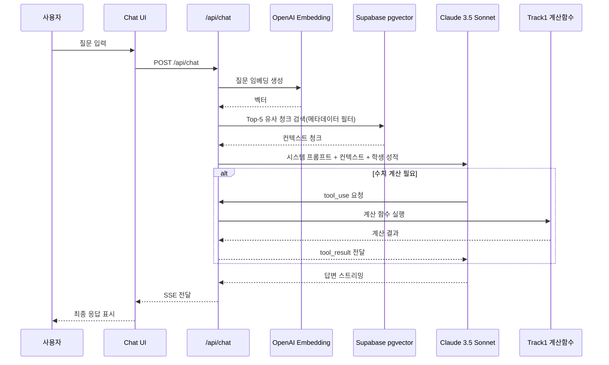

# AI Pipeline Design

`docs/01_PRD.md`, `docs/02_SYSTEM_DESIGN.md`, `docs/03_DB_SCHEMA.md`, `docs/04_API_SPEC.md`를 기준으로 작성한 univ 프로젝트 AI 파이프라인 설계 문서입니다.

## 1. AI 파이프라인 전체 개요

univ의 AI 파이프라인은 목적이 다른 2개 트랙으로 분리됩니다.

- **Ingest Pipeline (1회성/비정기)**  
  PDF 요강을 파싱하고 청킹/임베딩하여 `guideline_chunks(pgvector)`에 적재
- **Inference Pipeline (실시간)**  
  사용자 질문을 임베딩/검색한 뒤 Claude 3.5 Sonnet으로 추론하고, 필요 시 Tool Use로 Track 1 계산 함수를 호출해 응답 생성

---

## 2. Ingest Pipeline (데이터 적재 파이프라인)

### 2-1. PDF 파싱 (OpenDataLoader PDF v2.0)

- 도구: 한글과컴퓨터 오픈소스 **OpenDataLoader PDF v2.0** (Apache 2.0)
- 실행 위치: `scripts/ingest/parse_pdf.py` (로컬 1회 실행)
- 주요 기능 활용:
  - AI 기반 표 구조 인식(병합 셀, 복잡한 전형 비율표)
  - 수식 인식(수능 최저학력기준 조건식)
  - 출력 포맷: Markdown (표는 Markdown Table 유지)

주의사항:
- 파싱 결과는 반드시 원본 요강 PDF와 대조 검수
- 특히 숫자 필드(반영비율, 모집인원, 수능최저 조건)는 **100% 수동 확인**

### 2-2. 청킹 전략 (Chunking Strategy)

헤더 기반(Document-based) 청킹을 기본으로 사용합니다.

| 청킹 규칙 | 내용 |
|---|---|
| 분할 기준 | 요강 목차(H1/H2/H3) 헤더 단위 |
| 최대 청크 크기 | 1,500 토큰 (표 1개는 초과해도 분리 금지) |
| 최소 청크 크기 | 100 토큰 미만은 이전 청크에 병합 |
| 표 처리 | 표는 분리하지 않고 단일 청크로 유지 (Parent-Child 전략) |
| 오버랩 | 청크 간 100토큰 오버랩으로 문맥 연속성 보장 |

Parent-Child 청킹 전략:
- **Parent**: 표 전체 원문 (LLM 전달용 실제 컨텍스트)
- **Child**: 표 1~2문장 요약 (벡터 검색용 임베딩 대상)
- 검색 시 Child 임베딩으로 찾고, 최종 답변 생성에는 Parent를 컨텍스트로 사용

### 2-3. 메타데이터 태깅 전략

모든 청크에 아래 메타데이터를 필수 태깅합니다.

```json
{
  "university_name": "서강대",
  "admission_year": 2026,
  "admission_type": "논술전형",
  "category": "수능최저",
  "major_group": "자연계열",
  "page_number": 12
}
```

핵심 원칙:
- 메타데이터 필터링으로 검색 범위를 먼저 좁힌 뒤 벡터 검색 수행
- 컨텍스트 후보군을 줄여 환각(Hallucination) 가능성을 사전 차단

### 2-4. 임베딩 및 pgvector 적재

- 임베딩 모델: OpenAI `text-embedding-3-small` (1536차원)
- 선택 이유: 한국어 포함 다국어 성능 + 비용 효율(1M 토큰당 $0.02)
- 실행 스크립트: `scripts/ingest/embed_and_store.ts`
- 배치 처리: 20개 청크 단위(레이트리밋 대응)

적재 후 검증:
- 임의 질문 3개로 유사도 검색 테스트 수행
- `university_name`, `admission_type`, `admission_year` 필터가 정확히 작동하는지 확인

Ingest Pipeline 흐름:


---

## 3. Inference Pipeline (실시간 추론 파이프라인)

### 3-1. 전체 흐름



### 3-2. 하이브리드 검색 전략

순수 벡터 검색만으로는 "서강대 논술전형 수능최저" 같은 명시적 질의 품질이 저하될 수 있으므로 아래를 병행합니다.

- **Semantic Search**: pgvector 코사인 유사도 검색
- **Metadata Filter**: `university_name`, `admission_type`, `admission_year`를 WHERE 조건으로 선필터
- **최종 컨텍스트**: 유사도 상위 5개 청크(Top-5)

권장 검색 순서:
1. 질문에서 대학/전형/연도 엔티티 추출
2. 메타데이터 필터 적용
3. 벡터 유사도 정렬 후 Top-5 선택
4. 필요 시 Parent 청크로 확장

### 3-3. Claude Tool Use 연동

수치 계산이 필요한 질문은 Claude가 직접 계산하지 않고 반드시 Tool Use로 처리합니다.

Tool Use 처리 흐름:
1. Claude가 계산 필요성 판단
2. `tool_use` 블록으로 함수명 + 파라미터 반환
3. Next.js API Route가 Track 1 TypeScript 함수 실행
4. `tool_result`로 계산 결과를 Claude에 재전달
5. Claude가 결과를 자연어 해석하여 최종 답변 생성

강제 규칙:
- 계산 관련 문구(환산점수, 내신 산출, Z점수, 실질 경쟁률)가 포함되면 Tool Use 우선
- Tool 호출 실패 시 추정 계산 금지, 오류/재시도 안내 반환

---

## 4. 프롬프트 엔지니어링 전략

### 4-1. 시스템 프롬프트 설계 원칙

필수 원칙:
- 역할 정의: "당신은 대한민국 대입 전문 컨설턴트입니다."
- 계산 제약: "수치 계산은 반드시 제공된 도구(Tool)를 사용하세요. 직접 계산하지 마세요."
- 근거 제약: "요강 내용은 반드시 제공된 컨텍스트에서만 인용하세요. 모르면 모른다고 하세요."
- 언어 제약: "답변은 한국어로 작성하세요."
- 학생 컨텍스트: 매 요청마다 최신 성적 요약을 시스템 프롬프트에 주입

권장 시스템 프롬프트 템플릿:

```txt
역할: 당신은 대한민국 대입 전문 컨설턴트입니다.
목표: 사용자 질문에 대해 정확하고 근거 기반으로 답변합니다.

제약:
1) 수치 계산은 반드시 제공된 Tool을 사용하세요. 직접 계산 금지.
2) 제공된 컨텍스트(요강/룰/성적) 밖의 정보는 추정하지 마세요.
3) 근거가 없으면 "확인 불가"라고 답변하세요.
4) 답변은 한국어로 작성하세요.

출력 스타일:
- 핵심 결론 1~2문장
- 근거(요강 출처/계산 결과)
- 필요시 다음 행동 제안
```

### 4-2. 전형별 특화 프롬프트 모듈

프롬프트 파일 분리 위치: `src/lib/prompts/`

**정시 분석 프롬프트** (`src/lib/prompts/suneung.ts`)

```txt
학생의 수능 성적과 대학별 환산점수 계산 결과를 바탕으로
[안정/적정/도전] 판정 근거를 구체적인 점수 차이와 함께 설명하세요.
의대 증원으로 인한 커트라인 하락 보정이 적용된 경우 반드시 명시하세요.
```

**학종 Gap Analysis 프롬프트** (`src/lib/prompts/jonghap.ts`)

```txt
학생의 생기부 세특 데이터와 목표 대학의 평가요소(학업역량/진로역량/공동체역량)를 비교하여:
1. 현재 강점 (잘 드러난 역량)
2. 보완이 필요한 역량 Gap
3. 3학년 1학기 내에 실행 가능한 구체적 탐구주제 3개 (과목명과 주제 포함)
위 형식으로 반드시 답변하세요.
```

**논술 실질경쟁률 프롬프트** (`src/lib/prompts/nonchul.ts`)

```txt
수능 최저 충족 여부를 먼저 판단하고,
실질 경쟁률(명목 경쟁률 × 수능최저 충족률 × (1-결시율))을 계산 도구로 산출한 뒤
지원 권장 여부를 판단하세요.
```

### 4-3. 환각(Hallucination) 방지 전략 요약

| 위험 상황 | 방지 전략 |
|---|---|
| LLM이 점수를 직접 계산 | Tool Use 강제 + 시스템 프롬프트에 계산 금지 명시 |
| 요강에 없는 내용을 생성 | 메타데이터 필터 + 컨텍스트 외 답변 금지 규칙 |
| 구버전 요강 정보 혼입 | `admission_year` 필터 필수 적용 |
| 대학명/전형명 혼동 | `university_name`, `admission_type` 필터로 검색 범위 제한 |

---

## 5. 성능 및 비용 최적화

### 5-1. 응답 속도 최적화

- 스트리밍(SSE) 적용: 생성 중 체감 대기시간 단축
- 검색 최적화:
  - `guideline_chunks`에 HNSW 인덱스 사용
  - Top-k 고정(기본 5)으로 지연/비용 제어
- 캐싱 전략(P2):
  - 동일 대학/전형 반복 질문 캐싱
  - Redis 또는 Supabase Edge Function 캐시 적용 검토

### 5-2. 월간 API 비용 추정

| 항목 | 단가 | 예상 사용량 | 월 비용 |
|---|---|---|---|
| OpenAI Embedding (적재 1회) | $0.02 / 1M token | ~50K tokens | ~$0.001 |
| OpenAI Embedding (검색 실시간) | $0.02 / 1M token | 일 30회 × 300 token | ~$0.005 |
| Claude 3.5 Sonnet (Input) | $3 / 1M token | 일 10회 × 3K token | ~$0.9 |
| Claude 3.5 Sonnet (Output) | $15 / 1M token | 일 10회 × 500 token | ~$2.25 |
| **합계** |  |  | **~$3~4 / 월** |

운영 메모:
- PRD 비용 목표(월 $10 이내) 대비 충분한 여유
- 문서 길이 증가 시 Top-k/프롬프트 길이/출력 토큰 상한을 함께 조정

